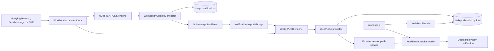
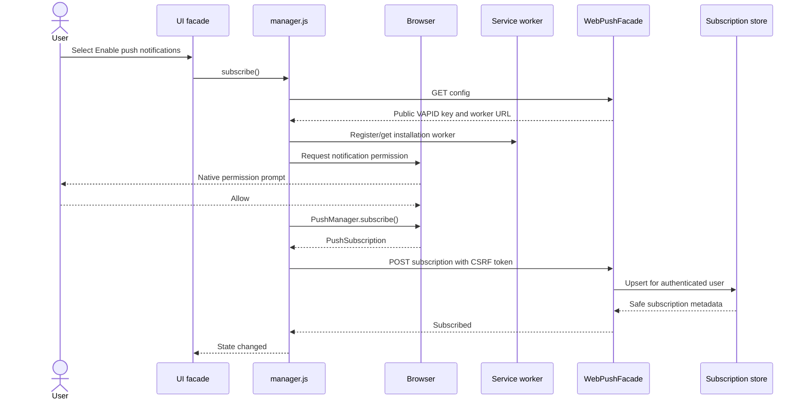
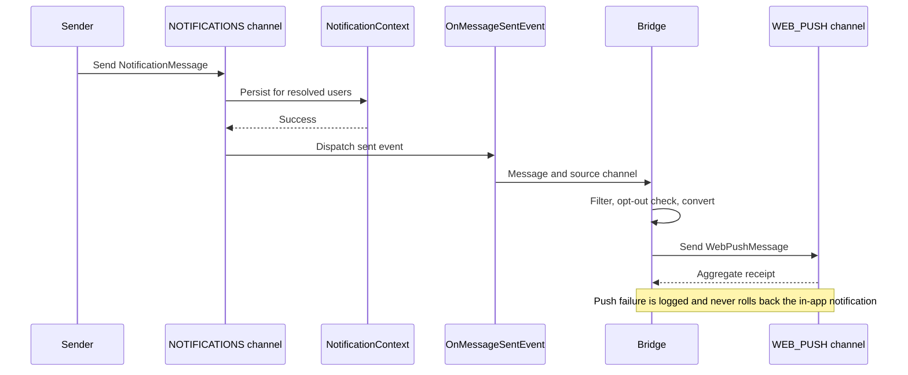

# Web push architecture

## Purpose and scope

This document proposes the architecture for browser push notifications in ExFace. It covers:

- direct delivery through a new `exface.Core.WEB_PUSH` communication channel;
- optional mirroring of successfully stored in-app notifications to web push;
- browser subscription management that can be reused by any UI facade;
- administration and lifecycle management of subscriptions;
- delivery from PHP through the standard Web Push protocol.

A web push notification is an additional delivery mechanism, not a replacement for an in-app notification. Direct messages sent to `WEB_PUSH` are intentionally not stored in the notification context. Mirrored messages retain the in-app notification as their durable workbench record.

## Architectural decisions

1. **Use the standard Web Push protocol with VAPID.** Do not bind the Core API to Firebase, Apple Push Notification Service, or another vendor-specific API. Browser vendors still operate the push services behind each subscription endpoint.
2. **Render the final notification payload in PHP.** The service worker validates and displays the payload; it does not fetch message content or render UXON.
3. **Store one record per browser push subscription.** A subscription belongs to a browser profile, origin, and service-worker registration. One physical device can therefore have multiple subscriptions, and reinstalling a browser or site can replace one.
4. **Keep the facade integration thin.** UI5Facade, JEasyUIFacade, and later facades include `api/webpush/manager.js` and expose a button that calls its public API. Subscription logic remains in Core.
5. **Use the existing communication abstractions.** `WebPushMessage` supplies the message model, `exface.Core.WEB_PUSH` supplies routing, and `WebPushConnector` performs protocol delivery.
6. **Mirror notifications only after successful in-app delivery.** A listener on `OnMessageSentEvent` filters for `exface.Core.NOTIFICATIONS`, converts the message, and sends it through `WEB_PUSH`. It must catch and log push failures so a push outage cannot turn an already stored in-app notification into a failed send.
7. **Use the installation-wide service worker.** Push handlers must be installed in the service worker that controls the workbench origin. Registering a second facade-specific worker for the same scope would cause conflicts.
8. **Treat subscription endpoints as secrets.** An endpoint is a capability URL. It and the associated encryption material must not be exposed in logs, exports, UI source, or error messages.

## System overview



## Major components

### `WebPushMessage`

Add `Communication/Messages/WebPushMessage.php`, based on `AbstractMessage`. The inherited recipient model already supports:

- `recipient_users`;
- `recipient_roles`;
- `recipient_users_filter`;
- exclusions and explicit `user://` or `role://` recipients.

The connector accepts only recipients that resolve to users. Unsupported address types are reported in the communication receipt and do not become arbitrary push endpoints.

Recommended UXON structure:

```json
{
    "channel": "exface.Core.WEB_PUSH",
    "recipient_users": ["jane.doe"],
    "recipient_roles": ["my.App.SUPPORT"],
    "title": "Ticket assigned",
    "text": "Ticket T-1042 was assigned to you.",
    "icon": "vendor/my.app/Icons/ticket-192.png",
    "badge": "vendor/exface/core/Icons/badge-96.png",
    "image": null,
    "url": "api/ui5/index.php?page=acme.support.ticket&uid=...",
    "tag": "ticket-T-1042",
    "renotify": false,
    "require_interaction": false,
    "ttl": 86400,
    "urgency": "normal",
    "topic": "ticket-T-1042",
    "reference": "ticket:T-1042"
}
```

Recommended properties:

| Property | Purpose |
| --- | --- |
| `title` | Required notification title. `subject` should be an alias for compatibility with other messages. |
| `text` | Short plain-text body. HTML and arbitrary widgets are not supported by browser notifications. |
| `icon` | Optional same-origin or approved HTTPS icon URL. |
| `badge` | Optional monochrome badge URL for supporting mobile platforms. |
| `image` | Optional larger image URL where supported. |
| `url` | URL opened when the notification is clicked. Prefer an authenticated workbench deep link. |
| `tag` | Browser-side replacement/grouping key. |
| `renotify` | Whether replacing an existing notification with the same tag should alert again. |
| `require_interaction` | Request a persistent notification where supported. Browsers may ignore it. |
| `ttl` | Seconds the push service may retain an undelivered message. |
| `urgency` | `very-low`, `low`, `normal`, or `high`. |
| `topic` | Protocol-level collapse key, limited to the Web Push protocol's allowed length and character set. |
| `reference` | Workbench correlation value for logs and deduplication; it is not shown to the user. |

The PHP renderer produces a small versioned JSON payload, for example:

```json
{
    "version": 1,
    "notification": {
        "title": "Ticket assigned",
        "options": {
            "body": "Ticket T-1042 was assigned to you.",
            "icon": "/vendor/my.app/Icons/ticket-192.png",
            "badge": "/vendor/exface/core/Icons/badge-96.png",
            "tag": "ticket-T-1042",
            "renotify": false,
            "requireInteraction": false,
            "data": {
                "url": "/api/ui5/index.php?page=acme.support.ticket&uid=...",
                "reference": "ticket:T-1042"
            }
        }
    }
}
```

Payloads should stay below 3 KB for broad compatibility. The renderer truncates excessive title or body text and rejects oversized custom data. It must not serialize `body_widget`, UXON actions, authorization data, or sensitive record contents. The browser notification can reveal content on a locked screen, so message authors should use neutral text for sensitive applications.

### `exface.Core.WEB_PUSH` communication channel

Add a communication channel model with:

- alias `exface.Core.WEB_PUSH`;
- message prototype `exface\Core\Communication\Messages\WebPushMessage`;
- a data connection using `WebPushConnector`;
- configurable default message values such as icon, badge, TTL, and urgency.

This lets `NotifyingBehavior`, `SendMessage`, templates, and direct communicator calls target web push without knowing subscription or protocol details.

### `WebPushConnector`

Add a connector implementing `CommunicationConnectionInterface`. Its responsibilities are:

1. Expand user and role recipient groups using the existing recipient classes.
2. Skip muted, disabled, anonymous, or unresolved users according to existing communication rules.
3. Deduplicate users, then load every active subscription for each user.
4. Render the final versioned payload in PHP.
5. Queue one encrypted Web Push request per active subscription and flush in bounded batches.
6. Return an aggregate communication receipt with counts for users, subscriptions, successes, temporary failures, and expired subscriptions.
7. Update subscription delivery metadata without storing payload content.
8. Mark permanently invalid subscriptions as expired or revoked.

An absent subscription is a normal no-delivery outcome, not a channel failure. One expired browser subscription must not prevent delivery to the user's other subscriptions.

Permanent responses, including HTTP `404` or `410` and the library's `isSubscriptionExpired()` result, set the subscription status to `EXPIRED`. Authentication or VAPID failures are connection-level errors and should be logged prominently. Timeouts, rate limits, and push-service errors remain retryable failures; phase one may report them synchronously, while a later queue can retry them.

### PHP Web Push library

The preferred library is [`minishlink/web-push`](https://github.com/web-push-libs/web-push-php), which provides:

- RFC 8030 Web Push requests;
- RFC 8291 payload encryption;
- RFC 8292 VAPID authentication;
- batching and per-subscription delivery reports;
- PSR-18 HTTP client integration.

Core should wrap the library in `WebPushConnector`; no library types should appear in the public communication interfaces or stored metamodel. This keeps a future replacement local to the connector.

The maintained library line must be selected against Core's supported PHP range. As of this design, the current major requires PHP 8.2 plus `mbstring`, `curl`, and `openssl` with elliptic-curve support; `bcmath` or `gmp` improves performance. Core currently declares `php: ^8`, so adding the latest library would effectively raise the minimum version. The implementation must either coordinate that runtime decision or select a compatible maintained release. Hand-written Web Push encryption is not an acceptable fallback.

For larger installations, an optional HTTPlug/Guzzle async adapter can enable pooled concurrent sends. It is not required for the initial synchronous implementation.

### Subscription model

Add a metamodel object such as `exface.Core.WEB_PUSH_SUBSCRIPTION`, backed by a dedicated SQL table. Recommended attributes are:

| Attribute | Notes |
| --- | --- |
| `UID` | Internal identifier. |
| `USER` | Required relation to `exface.Core.USER`; ownership never comes from request data. |
| `ENDPOINT` | Full capability URL. Store with sufficient length, preferably 2048 characters. Never show it in lists or logs. |
| `ENDPOINT_HASH` | SHA-256 hash used for indexed equality lookup and uniqueness. |
| `PUBLIC_KEY` | Browser `p256dh` encryption key. |
| `AUTH_TOKEN` | Browser authentication secret. |
| `CONTENT_ENCODING` | Subscription encoding if provided. |
| `EXPIRATION_TIME` | Browser-provided expiration time, often null. |
| `STATUS` | `ACTIVE`, `EXPIRED`, `REVOKED`, or `ERROR`. |
| `DEVICE_LABEL` | Optional user-editable label such as "Work laptop". |
| `USER_AGENT` | Optional diagnostic browser text; restrict visibility and retention. |
| `CREATED_ON` | First registration time. |
| `CONFIRMED_ON` | Last time `manager.js` confirmed the browser still holds this subscription. |
| `LAST_ATTEMPT_ON` | Last server delivery attempt. |
| `LAST_SUCCESS_ON` | Last push service acceptance. This does not prove that a person saw the notification. |
| `FAILURE_COUNT` | Consecutive temporary failures. Reset after success. |
| `LAST_ERROR_CODE` | Sanitized protocol/status code, without endpoint or payload. |
| `MODIFIED_ON` | Standard audit timestamp. |

Use a unique constraint on `(USER, ENDPOINT_HASH)`. Upsert the current user's record when the same browser reports it again. If endpoint ownership ever conflicts with another user, revoke or transfer it only through a deliberate authenticated flow; never silently expose the prior owner.

Users may list, rename, and revoke their own subscriptions. Administrators with user-management authorization may list and revoke subscriptions for any user. Deletion can be physical if audit policy permits; otherwise `REVOKED` records should be cleaned up after a configured retention period.

### `WebPushFacade`

Add an `AbstractHttpFacade` mounted at `api/webpush/`. It serves both facade-neutral JavaScript and authenticated JSON endpoints.

Proposed routes:

| Method and route | Authentication | Purpose |
| --- | --- | --- |
| `GET manager.js` | Public asset | Browser manager library. It contains no private configuration. |
| `GET config` | Authenticated | Capability status, VAPID public key, service-worker URL, scope, and localized labels. |
| `GET subscriptions` | Authenticated | List the current user's safe subscription metadata; never return endpoint or keys. |
| `POST subscriptions` | Authenticated + CSRF | Validate and upsert the current browser's `PushSubscription`. |
| `DELETE subscriptions/{uid}` | Authenticated + CSRF | Revoke a subscription owned by the current user. |
| `POST subscriptions/current/confirm` | Authenticated + CSRF | Refresh confirmation metadata for the current browser subscription. This may be folded into the upsert endpoint. |

The authenticated user is always taken from the workbench security context. The API must ignore a submitted user UID. Mutation endpoints require same-origin requests, CSRF protection, JSON content-type checks, request size limits, and normal HTTP authorization policies.

The facade validates endpoint scheme and host, key formats, supported content encoding, and payload lengths. It should accept browser-generated subscription JSON rather than inventing another client representation.

### `manager.js`

`api/webpush/manager.js` exposes one stable global or ES module API, for example:

```javascript
exfWebPush.isSupported();
exfWebPush.getState();
exfWebPush.subscribe();
exfWebPush.unsubscribe();
exfWebPush.openManagement();
```

It is responsible for:

- feature detection for service workers, notifications, and `PushManager`;
- loading public configuration from `WebPushFacade`;
- registering or obtaining the installation-wide service worker;
- reading the current `PushSubscription`;
- requesting notification permission only after an explicit user click;
- subscribing with `userVisibleOnly: true` and the VAPID public key;
- posting the resulting subscription to the facade;
- reconciling browser and server state on login or when the management UI opens;
- exposing state changes to facade UI code through events.

It must distinguish at least `unsupported`, `permission-default`, `subscribing`, `subscribed`, `denied`, `error`, and `signed-out`. UI facades should not duplicate this state machine.

Including the script alone must not show a browser permission prompt. Browsers increasingly suppress prompts without a user gesture, and an unexpected prompt causes users to deny permission permanently.

### Service-worker push module

Add a small module, for example `Facades/AbstractPWAFacade/webpush-sw.js`, through the existing `ServiceWorkerInstaller` import mechanism. It handles:

- `push`: parse the versioned JSON payload and call `registration.showNotification()`;
- `notificationclick`: close the notification, focus a matching same-origin workbench window, or open the payload URL;
- `notificationclose`: optional local telemetry only if explicitly required;
- `pushsubscriptionchange`: attempt resubscription when supported, then synchronize it when authentication is available.

The click handler must accept only same-origin or explicitly allow-listed HTTPS URLs. Unknown payload versions or malformed payloads should produce a generic notification or be logged locally, never execute supplied code.

The service worker is shared infrastructure. Core contributes the push handlers once; UI5Facade and JEasyUIFacade must register the generated installation-wide worker rather than produce separate push workers. `manager.js` should make registration idempotent, so a facade that already registered it requires no special path.

Web Push and service workers require a secure context. Production deployments therefore require HTTPS. Localhost may be treated specially by browsers for development. Embedded cross-origin iframes cannot be assumed to request notification permission successfully; the subscription action may need to open a top-level same-origin page.

### Notification-to-push bridge

Register a Core listener for `OnMessageSentEvent`:

1. Ignore every channel except `exface.Core.NOTIFICATIONS`.
2. Check a global configuration option such as `COMMUNICATION.WEB_PUSH.MIRROR_IN_APP_NOTIFICATIONS`.
3. Convert the sent `NotificationMessage` to `WebPushMessage`.
4. Preserve resolved user and role recipients and exclusions.
5. Map title, plain text, icon, reference, and an appropriate workbench URL.
6. Send through `exface.Core.WEB_PUSH`.
7. Catch and log all push errors without rethrowing them into the completed notification send.

Filtering by source channel prevents recursion because the second `OnMessageSentEvent` is for `WEB_PUSH`, not `NOTIFICATIONS`. The bridge should also support an explicit per-message opt-out, for example `web_push: false`, so sensitive or noisy in-app messages stay in-app only. A per-user preference can be added later without changing the channel contract.

If converting a rich `body_widget`, the bridge uses the message's plain `text` or title; it does not try to render arbitrary widgets into a browser notification.

### User and administration pages

Add the subscription object to the existing user-administration UI as a related table. Safe columns include label, browser summary, status, created, confirmed, last attempt, last success, and sanitized last error. Endpoint and key columns must be hidden and access-protected even for ordinary administrators unless a diagnostic need is established.

Also provide a current-user management dialog reachable from the notification context menu. This gives users a facade-neutral place to:

- see whether the current browser supports push;
- subscribe the current browser;
- understand when browser permission is denied;
- label the current subscription;
- list and remove their own other subscriptions.

The context menu button can invoke a small facade action that delegates to `exfWebPush`. UI5Facade and JEasyUIFacade need only include the manager script and map that action to their normal dialog/button rendering.

## Process flows

### User subscribes the current browser



If permission is denied, ExFace records no subscription and explains how to re-enable notifications in browser settings. It must not repeatedly prompt. If browser subscription succeeds but server persistence fails, the manager may unsubscribe the new browser subscription or clearly show an unsynchronized error and retry only after user action.

### Direct web push delivery

1. `NotifyingBehavior`, `SendMessage`, or PHP creates a message with channel `exface.Core.WEB_PUSH`.
2. The communication layer instantiates `WebPushMessage` and resolves users and roles.
3. `WebPushConnector` loads all active subscriptions for each resolved user.
4. PHP renders and encrypts one payload per subscription and sends it to the subscription's browser push service.
5. Each browser push service accepts, temporarily rejects, or permanently rejects the request.
6. The connector updates subscription health and returns an aggregate receipt.
7. The browser starts the service worker, which displays the already rendered notification.
8. Clicking the notification focuses or opens the workbench deep link.

No row is added to `exface.Core.NOTIFICATION` in this flow.

### Mirrored in-app notification



This flow gives the user a durable in-app record and an ephemeral browser alert. Clicking the push should open the relevant page or the notification list; it need not mark the in-app notification as read automatically unless the target route explicitly does so.

### User revokes a subscription

1. The user opens push management and selects a registered browser.
2. `WebPushFacade` verifies ownership and marks the server record `REVOKED` or deletes it according to retention policy.
3. For the current browser, `manager.js` also calls `PushSubscription.unsubscribe()`.
4. For another or lost device, server revocation is sufficient; later sends skip it.

Logging out does not automatically revoke a subscription because users expect background notifications while signed out. Shared-device installations should provide an explicit policy to revoke the current subscription on logout.

### Administrator manages subscriptions

1. An administrator opens a user and views related web push subscriptions.
2. The list shows meaningful timestamps and status without endpoint or encryption secrets.
3. The administrator may revoke suspicious, stale, or user-reported subscriptions.
4. The action records the acting administrator through normal audit facilities.
5. Cleanup periodically removes expired and revoked records after the configured retention period.

`LAST_SUCCESS_ON` means the vendor push service accepted a send. `CONFIRMED_ON` means the browser reported that it still owns the subscription while visiting the workbench. Neither value proves that the device was used or that the notification was read; UI captions must avoid claiming otherwise.

### Subscription expires or changes

1. A send report identifies a permanently expired endpoint, or the browser fires `pushsubscriptionchange`.
2. The connector marks the old record `EXPIRED` immediately when the push service rejects it permanently.
3. If the browser can create a replacement subscription and authenticate to ExFace, `manager.js` or the service worker sends the replacement to `WebPushFacade`.
4. Otherwise, the next authenticated page visit reconciles browser and server state.
5. The user sees the new active record and the old record disappears after retention cleanup.

## Deployment setup

### External service registration

The proposed standards-based implementation does **not** require an account or an application registration with Google Firebase, Mozilla, Microsoft, or Apple. It also does not require an Apple Developer Program membership. The browser selects its own push service when it creates a subscription and returns that service's endpoint to ExFace. `WebPushConnector` sends directly to those endpoints using the Web Push protocol.

VAPID replaces vendor-specific application registration. The installation generates a public/private key pair and supplies a stable contact URI, called the VAPID subject. Push services use these values to identify the sending application server:

- the public key is sent to browsers when they subscribe;
- the private key signs outgoing push requests and never leaves the server;
- the subject is normally a monitored `mailto:` address or a public HTTPS contact URL.

Seeing an endpoint below an FCM or Apple domain does not mean that the operator must create an account there. Those services are selected transparently by Chrome, Safari, and other browsers.

An external account is needed only if ExFace deliberately adopts a managed push provider such as OneSignal or a cloud notification broker instead of the direct architecture in this document. That would introduce a provider project, credentials, client SDK, data-processing agreement, and provider-specific connector. It is optional and is not recommended for the first implementation.

### Keys per installation and client

Use one stable VAPID key pair per independently operated installation and security boundary:

| Deployment model | Recommended VAPID setup |
| --- | --- |
| One client with a dedicated ExFace installation | Generate one key pair for that installation. |
| Several clients, each with a separate installation | Generate a separate key pair for every client installation. |
| Multi-tenant SaaS where clients share one installation and origin | Use one key pair for the shared installation; do not create one per tenant. |
| Multiple application servers serving the same installation | All nodes use the same key pair from the shared secret store. |
| Development, test, and production environments | Use separate key pairs so a leaked non-production key cannot affect production subscriptions. |
| One installation exposed through multiple origins | Subscriptions are separate per origin. A shared installation key is technically possible, but separate keys are preferable when the origins are separate trust or operational boundaries. |

The key pair belongs to the deployment, not to an individual user, browser, facade, or message channel. It is generated once, backed up as a secret, and reused for all subscriptions created against that installation. Reinstalling or scaling the same installation must restore the existing key rather than generate a new one.

Changing or losing the private key prevents reliable delivery to subscriptions created with the old public key. Key rotation therefore requires a controlled transition and browser resubscription. It must not happen automatically during an application update.

### Installation procedure

For every independently deployed installation that enables web push:

1. **Check the runtime.** Install the selected compatible `minishlink/web-push` release and verify PHP, `mbstring`, `curl`, and OpenSSL elliptic-curve support. Install `bcmath` or `gmp` where available for better cryptographic performance.
2. **Provide HTTPS.** Serve every production facade and `api/webpush/` endpoint through a valid HTTPS origin. Configure the reverse proxy so ExFace generates the public HTTPS service-worker and click URLs.
3. **Allow outbound push traffic.** Permit HTTPS requests from the application servers to subscription endpoint hosts supplied by browsers. Do not hard-code only Google hosts. Apple deployments may require `*.push.apple.com`; other browsers use other services.
4. **Generate the VAPID identity once.** The Core installer or an administration command should call the library's `VAPID::createVapidKeys()` and print or store the URL-safe public and private keys. Generate keys locally on the installation server or in the organization's secret-management system, never with an untrusted online generator.
5. **Store configuration securely.** Put the private key in an environment variable or secret store. Configure the matching public key and a stable VAPID subject such as `mailto:operations@example.com`. Only the public key may be returned by `WebPushFacade`.
6. **Install server components.** Run the Core model and SQL installers to create the subscription object, communication connection, and `exface.Core.WEB_PUSH` channel.
7. **Generate the shared service worker.** Run `ServiceWorkerInstaller` so the push and notification-click handlers are present in the installation-wide worker. Confirm that its scope covers UI5Facade and JEasyUIFacade URLs.
8. **Enable facade integration.** Include `api/webpush/manager.js` and expose the subscription action in the notification context menu. For iOS and iPadOS, also provide a web app manifest suitable for installation to the Home Screen.
9. **Choose delivery policy.** Enable direct `WEB_PUSH` sending and decide whether `COMMUNICATION.WEB_PUSH.MIRROR_IN_APP_NOTIFICATIONS` is enabled for the installation.
10. **Run an end-to-end test.** Subscribe one test user through an explicit click, close the workbench, send a harmless test message, verify display and click navigation, then revoke the subscription and confirm that later sends skip it.

An installer should validate that the public and private keys match, the VAPID subject is valid, HTTPS is detected, required PHP extensions are loaded, and the service-worker file is reachable. It should never overwrite an existing private key.

### Ongoing operations

- Back up the VAPID private key through the same controlled process as other application secrets.
- Monitor rejected requests, expired subscriptions, and VAPID authentication failures without logging endpoints or payloads.
- Re-run the end-to-end test after changing domains, reverse proxies, service-worker scope, content-security policy, or VAPID configuration.
- Update firewall rules when real subscriptions introduce a push-service host that is not yet reachable.
- Treat an installation clone as a new security boundary: replace the cloned VAPID keys and clear cloned subscriptions unless it is a deliberate failover of the same installation.

## Configuration and secrets

Recommended configuration values are:

- web push enabled/disabled;
- VAPID subject, public key, and private key;
- default icon and badge;
- default TTL, urgency, batch size, and request timeout;
- whether in-app notifications are mirrored by default;
- allowed click URL origins;
- stale, expired, and revoked retention periods;
- optional temporary-failure threshold before status changes to `ERROR`.

Generate one stable VAPID key pair per deployment. Store the private key in a secret store or environment-backed configuration, never in metamodel JSON, generated JavaScript, source control, logs, or database exports. `config` and `manager.js` expose only the public key. Rotating the key pair can invalidate existing subscriptions and therefore requires an explicit resubscription plan.

## Security and privacy

- Require HTTPS in production.
- Require an authenticated, non-anonymous workbench user for subscription mutations.
- Apply CSRF protection to create, confirm, and delete operations.
- Derive subscription ownership only from the security context.
- Keep endpoints and key material out of logs, debug widgets, receipts, UI tables, and exception text.
- Consider application-level encryption at rest for endpoint, public key, and auth token while retaining `ENDPOINT_HASH` for lookups.
- Reject non-HTTPS endpoints outside development and validate their maximum length.
- Restrict click URLs to same-origin or an explicit allow-list and never execute payload code.
- Do not put access tokens, session identifiers, record secrets, or complete in-app widget UXON into payloads.
- Respect the user's global disabled-communication flag and recipient mute behavior.
- Add rate limits to subscription endpoints and sensible send batching to prevent abuse.
- Document retention of user-agent and delivery metadata; avoid browser fingerprinting fields that are not operationally necessary.

## Reliability and scaling

The first implementation may send synchronously because this matches current communication-channel behavior. It must batch requests and isolate per-subscription failures. Before enabling broad role-based messages in large installations, measure end-to-end send time and memory use.

A later delivery queue can move protocol calls out of the business transaction without changing `WebPushMessage` or the channel. Queue items should contain a rendered payload and target subscription UID, not raw VAPID secrets. The worker rechecks subscription status before sending and records an idempotency/correlation reference.

Retries are suitable only for temporary network, `429`, and `5xx` responses and must use bounded exponential backoff. Permanent invalid-subscription responses are never retried. Mirrored push delivery remains best effort; the in-app notification is the durable fallback.

Suggested operational metrics are attempted subscriptions, accepted sends, temporary failures, expired endpoints, users without active subscriptions, and batch duration. Metrics and logs use internal UIDs or counts, never full endpoints or payload bodies.

## Browser and facade considerations

- Desktop Chromium, Firefox, Edge, and Safari support standard web push in current versions.
- Mobile browser behavior varies. In particular, iOS web push requires a supported Safari version and may require the site to be installed as a home-screen web app.
- Embedded web views are not a reliable target.
- Browser permission is per origin and browser profile, not per ExFace facade.
- A deployment served from multiple origins needs separate subscriptions and usually separate VAPID configuration per origin.
- The service worker scope must include every facade URL that should be opened or focused.
- UI5Facade and JEasyUIFacade should expose the same states and actions even if their visual controls differ.

## Implementation stages

### Stage 1: Protocol and persistence

- Select a compatible `minishlink/web-push` release and add the Composer dependency.
- Add VAPID configuration and installation checks.
- Add the subscription SQL table and metamodel object for all supported databases.
- Implement `WebPushMessage`, `WebPushConnector`, channel model, and receipts.
- Validate direct sends to one user with multiple browser subscriptions.

### Stage 2: Browser subscription management

- Implement `WebPushFacade`, `manager.js`, and the service-worker push module.
- Add current-user management UI and the notification-context action.
- Integrate the script and action in UI5Facade and JEasyUIFacade.
- Validate subscribe, deny, unsubscribe, click, expiration, and resubscription flows on desktop and mobile browsers.

### Stage 3: In-app mirroring and administration

- Add the filtered, non-throwing `OnMessageSentEvent` bridge.
- Add global default and per-message opt-out configuration.
- Add user-administration related lists and revoke actions.
- Add cleanup and operational metrics.

### Stage 4: Scale and preferences

- Measure large role sends before optimization.
- Add queued/asynchronous delivery if measurements justify it.
- Add per-user categories, quiet hours, or channel preferences only after the base lifecycle is reliable.

## Acceptance criteria

- A user can explicitly subscribe a supported browser from UI5Facade and JEasyUIFacade.
- The same user can hold multiple active subscriptions and receive a message on each one.
- `recipient_users` and `recipient_roles` resolve to users and never expose subscriptions to senders.
- Direct `WEB_PUSH` messages do not create in-app notification rows.
- A successfully stored in-app notification can be mirrored exactly once to `WEB_PUSH` without recursion.
- Push delivery failure cannot roll back or report failure for an already stored in-app notification.
- Expired subscriptions are detected, skipped on later sends, visible to administrators, and eventually cleaned up.
- Users can list and revoke their own subscriptions; authorized administrators can revoke any user's subscription.
- Endpoints, key material, VAPID private keys, and payload bodies do not appear in logs or normal administration views.
- Permission is requested only in response to a user gesture.
- A received payload displays while the workbench is closed, and clicking it opens or focuses an allowed workbench URL.
- HTTPS, CSRF, same-origin URL validation, and supported-browser failure states are verified.
- Desktop Chromium, Firefox, Edge, Safari, Android Chrome, and supported iOS Safari/PWA behavior are documented from real-device tests.

## Open decisions

- Whether the Core runtime baseline may be raised to use the current maintained `minishlink/web-push` major.
- Whether mirrored web push is globally on by default or enabled per installation.
- Whether subscriptions are physically deleted or retained as revoked audit records.
- Whether logout from shared devices should offer or enforce revocation of the current browser.
- Which deep link should be used when an in-app notification has no explicit URL.
- At what measured volume synchronous sends must move to a queue.
