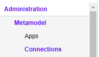
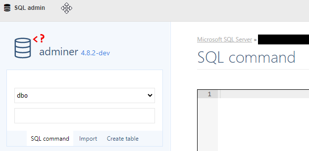

# Setting up an SQL DB and a data source in the model

[<kbd> <br> BookClub tutorial <br> </kbd>](index.md) [<kbd> <br>< Previous <br> </kbd>](02_Creating_a_new_app.md) [<kbd> <br>Next > <br> </kbd>](04_Generating_a_model_from_an_SQL_schema.md)

Now that we have an [app](02_Creating_a_new_app.md), we need to let the workbench know, that our [newly created database](01_Preparation.md) is a data source this app can access. 

A data source basically consists of two things:
- a data connection, which contains all the information required to establish a connection
- a query builder that allows the workbench to talk to the data source.

Note, that multiple connections can be used for a data source: e.g. separate databases for staging and production are different connections for the same data source - namely our SQL DB.

Data sources can be very different: databases, web services, files, etc. The logic of the data source is represented by the combination of query builder and connection. The two, of course, must be compatible. You can find the documentation for all available query builders and connectors (connection types) in the corresponding subsections of the menu under `Administration > Documentation`.

Since we need to tell our data source, which connection to use, we will start with creating the connection first.

## 1. Create a data connection

Connections can be very different too: after all, it's quite a difference if you connect to an SQL DB or a web service. Yet both - a database and a web service - can be configured as a connection in the metamodel. The difference lies in the "connection prototype" (or simply "connector") used. The prototype is basically a PHP class, that actually establishes the connection by interpreting all the configuration we provide in the connection model. 

Let's create a data connection to our new DB:

1. Navigate in the main menu to `Administration > Metamodel > Connections`. Here you can see all data connections the workbench can currently use.
2. Press the `+ New` button in the table with the connections.
3. Fill the dialog with the following values:
	- Connection Name: `BookClub SQL DB localhost`
	- Is part of app: `tutorial.BookClub`
	- Connection Alias: `BOOKCLUB_DB_LOCAL`
	- Connector: `MySqlConnector`
4. Press the big magic-wand-icon in the middle of the configuration area
5. Select `MySQL connection with relation matcher` from the list of available presets and press the `Replace` button at the bottom of the dialog
6. Fill the configuration values as follows:
	- host: `127.0.0.1` (using an IP is faster than a network name in most cases!)
	- dbase: `tutorial_<kuerzel>`
	- charset: `utf8`
	- user: the username to connect to the MySQL server
	- password: the password for the user above
	- relation_matcher: leave as is (see explanation below)
7. Press `Save`


Our new connection should now appear at the top of the list.

The `MySqlConnector` prototype, that we use here works for MySQL databases as the name suggests. It's configuration (host, dbase, etc.) is also specific to MySQL and may look very different for another data source or even another database engine. You can find the documentation for all available connectors in the main menu at `Administratyion > Documentation > Data Connectors`.

The idea of prototypes with their specific hierarchical configuration is a central concept. There are prototypes for a lot of things: widgets, actions, data types, etc. The configuration is done via our modeling language called [UXON](../../UXON/index.md) (User eXperience Object Notation) in special [editors](../../UXON/Introduction_to_the_UXON_editor.md), that provide autosuggest, presets (the magic wand above), quick refference, etc. The editor knows, what configurable properties each prototype has and can even suggest possible values in many cases.

## 2. Create a data source

Now that we have a connection, we can use it in a data source:

1. Navigate in the main menu to `Administration > Metamodel > Data Sources`. Here you can see all data sources with their current connections.
2. Press the `+ New` button in the table with the data sources.
3. Fill the dialog with the following values:
	- Data Source Name: `BookClub DB`
	- Is part of app: `tutorial.BookClub`
	- Data Source Alias: `BOOKCLUB_DB`
	- Default Connection: `BookClub SQL DB localhost`
	- Default Query Builder: `MySqlBuilder`
4. Press `Save`


Now we have a data source in the model of the app `tutorial.BookClub` which uses our database as it's default connection.

Note, that apart from the default connection and query builder (that we have filled above) there is an option to switch temporarily to another set of the two - the "current" connection and query builder. The difference is that the defaults are saved in the app's package and thus will be transferred to another server together with the app. The "current" ones are local settings only and will only have effect on this particular server.

Read more about data sources and connections in the [model docs](../../creating_metamodels/data_sources/index.md).

## 3. Create a new database for the book club

We will use a MySQL database to store all the data required for the [book club tutorial](index.md).

Copy & paste the following SQL to our Adminer Database Management Tool. It will create a database named `tutorial_bookclub`. You can change that name, of course, but you will need to keep track of it in all subsequent steps yourself!

To access Adminer, follow these steps:

1. Navigate to Administration -> Metamodel -> Connections



2. Select your database and press the button "SQL admin".



3. You are now inside of Adminer Database Management Tool. Here click the link "SQL command" on the upper left side. Now you can paste the following SQL and press "Execute". The database for your bookclub is now created.

```
CREATE DATABASE IF NOT EXISTS `tutorial_bookclub` DEFAULT CHARACTER SET utf8 COLLATE utf8_general_ci;
USE `tutorial_bookclub`;

-- --------------------------------------------------------

CREATE TABLE IF NOT EXISTS `book` (
  `id` int(11) NOT NULL AUTO_INCREMENT,
  `created_on` datetime DEFAULT NULL,
  `created_by_user_id` binary(16) DEFAULT NULL,
  `modified_on` datetime DEFAULT NULL,
  `modified_by_user_id` binary(16) DEFAULT NULL,
  `title` varchar(100) NOT NULL,
  `series` varchar(100) DEFAULT NULL,
  `author` varchar(200) DEFAULT NULL,
  `description_toc` TEXT NULL,
  `isbn` varchar(13) DEFAULT NULL,
  `publisher` varchar(50) DEFAULT NULL,
  `book_size` varchar(10) NULL DEFAULT '',
  `year` int(4) DEFAULT NULL,
  `age_min` int(2) DEFAULT NULL,
  `age_max` int(2) DEFAULT NULL,
  `pages` int(11) DEFAULT NULL,
  `language_id` int(11) DEFAULT NULL,
  `owner_id` int(11) NOT NULL,
  `owner_comment` TEXT NULL,
  `owner_rating` int(1) DEFAULT NULL,
  PRIMARY KEY (`id`)
) ENGINE=InnoDB AUTO_INCREMENT=10 DEFAULT CHARSET=utf8;

-- --------------------------------------------------------

CREATE TABLE IF NOT EXISTS `book_category` (
  `id` int(11) NOT NULL AUTO_INCREMENT,
  `created_on` datetime DEFAULT NULL,
  `created_by_user_id` binary(16) DEFAULT NULL,
  `modified_on` datetime DEFAULT NULL,
  `modified_by_user_id` binary(16) DEFAULT NULL,
  `category_id` int(11) NOT NULL,
  `book_id` int(11) NOT NULL,
  PRIMARY KEY (`id`) USING BTREE
) ENGINE=InnoDB DEFAULT CHARSET=utf8 ROW_FORMAT=DYNAMIC;

-- --------------------------------------------------------

CREATE TABLE IF NOT EXISTS `category` (
  `id` int(11) NOT NULL AUTO_INCREMENT,
  `created_on` datetime DEFAULT NULL,
  `created_by_user_id` binary(16) DEFAULT NULL,
  `modified_on` datetime DEFAULT NULL,
  `modified_by_user_id` binary(16) DEFAULT NULL,
  `name` varchar(50) NOT NULL,
  PRIMARY KEY (`id`) USING BTREE
) ENGINE=InnoDB DEFAULT CHARSET=utf8 ROW_FORMAT=DYNAMIC;

-- --------------------------------------------------------

CREATE TABLE IF NOT EXISTS `language` (
  `id` int(11) NOT NULL AUTO_INCREMENT,
  `created_on` datetime DEFAULT NULL,
  `created_by_user_id` binary(16) DEFAULT NULL,
  `modified_on` datetime DEFAULT NULL,
  `modified_by_user_id` binary(16) DEFAULT NULL,
  `name` varchar(50) NOT NULL,
  PRIMARY KEY (`id`) USING BTREE
) ENGINE=InnoDB DEFAULT CHARSET=utf8 ROW_FORMAT=DYNAMIC;

-- --------------------------------------------------------

CREATE TABLE IF NOT EXISTS `loan` (
  `id` int(11) NOT NULL AUTO_INCREMENT,
  `created_on` datetime DEFAULT NULL,
  `created_by_user_id` binary(16) DEFAULT NULL,
  `modified_on` datetime DEFAULT NULL,
  `modified_by_user_id` binary(16) DEFAULT NULL,
  `member_id` int(11) NOT NULL,
  `book_id` int(11) NOT NULL,
  `taken` date NOT NULL,
  `given_back` date DEFAULT NULL,
  `comment` varchar(200) DEFAULT NULL,
  PRIMARY KEY (`id`) USING BTREE
) ENGINE=InnoDB DEFAULT CHARSET=utf8 ROW_FORMAT=DYNAMIC;

-- --------------------------------------------------------

CREATE TABLE IF NOT EXISTS `member` (
  `id` int(11) NOT NULL AUTO_INCREMENT,
  `created_on` datetime DEFAULT NULL,
  `created_by_user_id` binary(16) DEFAULT NULL,
  `modified_on` datetime DEFAULT NULL,
  `modified_by_user_id` binary(16) DEFAULT NULL,
  `name` varchar(50) NOT NULL,
  `user_oid` binary(16) DEFAULT NULL,
  PRIMARY KEY (`id`) USING BTREE
) ENGINE=InnoDB DEFAULT CHARSET=utf8 ROW_FORMAT=DYNAMIC;
COMMIT;

```

[<kbd> <br> BookClub tutorial <br> </kbd>](index.md) [<kbd> <br>< Previous <br> </kbd>](02_Creating_a_new_app.md) [<kbd> <br>Next > <br> </kbd>](04_Generating_a_model_from_an_SQL_schema.md)