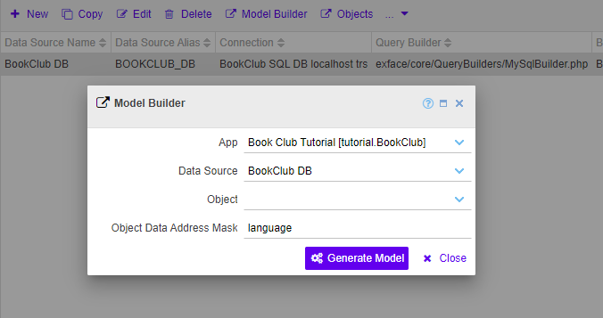
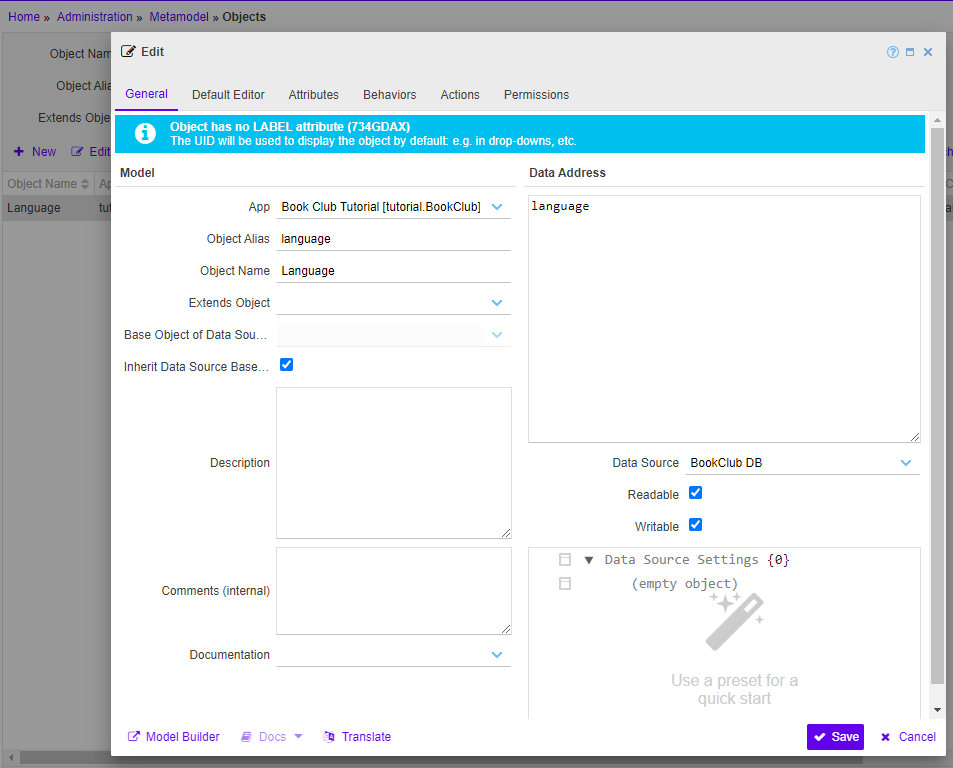
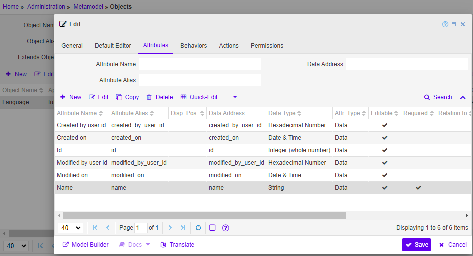
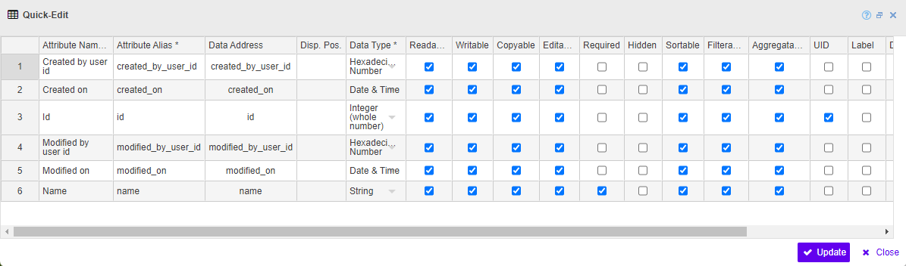

# Generating a metamodel from an SQL schema

#### [< Previous](03_Connecting_to_an_sql_database.md) | [BookClub tutorial](index.md) | [Next >](05_Creating_the_apps_first_pages.md)

Now that we have a [data source](03_Connecting_to_an_sql_database.md) for our [BookClub tutorial](index.md), we can start modeling the actual data. The core of the metamodel is a graph model of the business objects related to the app. This is similar to the relational model of an SQL database with the main difference being the focus on relations between these objects.

For a start it is safe to assume, that every database table should become a meta object with attributes for every column of that table. The same goes for views. This stub of a model can be easily generated with a single click. 

In fact, many types of data sources provide descriptive information about the structure of their data similarly to database schemas. Many data connectors provide so-called model builders, that can generate more-or-less detailed metamodels from this information. A detailed description of the capabilities of every model builder can be found in  `Administration > Documentation > Model Builders`.

## 1. Generate a simple meta object

To get familiar whith meta objects we will import a very simple SQL table first - the [language](01_Preparation.md) table. It should contain book languages - the values of the dropdown menu to select the language for each book. The table has the following structure in the database:

- `id` - an autogenerated unique integer value that identifies the entry technically
- `created_on` - date and time when the table entry was created
- `created_by_user_id` - UUID of the workbench user that created the entry
- `modified_on` - date and time when the table entry was last modified
- `modified_by_user_id` - UUID of the user that performed the last modification
- `name` - the name of the language in the app's default language (english)

The first five columns are system columns, that are present in all tables - which is a very common practice. The `name` is the only real property of a language.

It is a good idea to try to import such a minimal table before proceeding with the rest of the SQL schema. As it will be shown below, identifying such "system columns" as above can save a lot of manual fine-tuning.

Now let's crate a meta object for the language.

1. Remain at `Administration > Metamodel > Data Sources` in the main menu.
2. Select the [newly created](03_Connecting_to_an_sql_database.md) ´BookClub DB´
3. Press `Generate Model` button
4. Fill the dialog fields as follows
	- Object Data Address Mask: `language` 

	

5. Press `Generate Model`	
6. After the action succeeds, select the data source again and press the `Objects` button

This will send us one step further in the main menu to the list of meta objects. Since we wanted to see the objects of our app specifically, the list is already filtered by app. You should now see the new `Language` object in the table.

## 2. Get to know the meta object structure

Double click it to open the object editor (or press the `Edit` in the button). 

The object dialog is organized in tabs. Each tab has it's own focus and controls while the bottom button bar is available in all tabs.

Hover over the controls with the mouse pointer to see a short hint or press the `?` icon at the top of the dialog to open the contextual help with all the field descriptions listed.

### The `General` tab

The first tab we see contains general information about the meta object. As most components of the model, objects have names and aliases and are bound to apps. 

The alias of our object is `language` - the model builder simply used the name of the table. This is a good idea since it helps people who know the database schema to get around. Since the object is part of the app `tutorial.BookClub`, it's fully qualified alias will be `tutorial.BookClub.language` which is unique among all apps that could possible have language-objects.

Perhaps the most important for a meta object is it's data address. This section contains information about where to find the data in the object's data source. The data address depends on the query builder used in the data source. For SQL query builders like our `MySqlBuilder` you can use table names here or any valid SQL SELECT statement put in parentheses. Most query builders allow to add more information than merely a textual address - this is where the data source configuration below comes into play. We don't need that for a simple SQL table though. 

You can also explicitly disable reading or writing operations for the object here.

### The `Attributes` tab

Here we can see, that the model builder generated an attribute for every column of the table. Feel free to look around: you can open an attribute by double clicking it or via `Edit` button.

Each attribute, again, has a name and an alias - the latter being the column name for imported attributes. An attribute also has a data adress, which depends on the query builder and defaults to the column name for SQL builders. Similarly to the object's data address we can also use any valid SQL SELECT clause in parenthes. There are also additional data address options as you can see in the `id` column for example. These too are specific to the query builder.

As you can see, the metamodel contains much more information about each attribute than the database schema, so in the vast majority it is a good idea to do some fine tuning after importing the model.

For example, we humans know that the table column `created_by_user_id` contains a link to the workbench's internal user objects, but there is no way to get this information out of the DB schema. Adding relations is the most typical thing to do after a model import along with adding all sorts descriptions and so on.

Let's specify relations for `created_by_user_id` and `modified_by_user_id`:

1. Open the attribute
2. Type `user` in the field "Relation to" and select the user object from the Core app in the dropdown menu
3. Remove the `_id` suffix from the alias of the attribute changing it to `created_by_user`.
4. Change the attribute name to `Created by`
5. Press `Save`

Now we have relations between the object `Language` of the BookClub app and the object `User` of the Core app. Changing the alias and the name of the attributes was only for beautification. However, removing all sorts of `_id` suffixes from the alias of relations is a good practice as it helps follow relation paths a lot as we will see further on. The model builders to it by default too if they can identify a relation automatically!

### Other tabs

The other tabs are empty for now. We will populate them and talk about them when needed in the upcoming chapters. 

- `Default Editor` - here we can define a widget, that will be used to open the object. If no editor is defined, the workbench will attempt to generate one - which works perfectly well for smaller objects as ours.
- `Behviors` add some typical logic patterns to an object: like the [TimeStampingBehavior](X_Adding_behaviors.md) that we will add later to save the time of creation and last update for every object.
- `Actions` are preconfigured action models to be used with buttons: for example, showing a simple [dialog to loan a book](X_Adding_object_actions.md). 
- `Permissions` are security policies, that apply to this object directly. There are lot's of things policies can be applied to, so tabs like this are quite common in model component editors. We will deal with [action policies](X_Configuring_security_and_permissions.md) later on as an example.

## 3. Create a base object?

As mentioned above all our tables have a standard set of system columns, which is quite a common situation. In this case we can specify a base object for the data source to make all meta objects automatically inherit these common attributes. Not only will this save time as we won't have to configure relations for `created_by_user_id` and `modified_by_user_id` for each object as we did above, but having a base object will also allow us to add behaviors, that will affect all objects of the data source.

As a rule of thumb: always create a base object _before_ importing the data source schema if 80% of the objects are going to share common columns.

Let's convert our language object into a base object. We will regenerate a new meta object for the actual language afterwards.

1. Go to the `Attributes` tab in the object editor 
2. Delete the `name` attribute. Now the object only contains common attributes.
3. Press `Quick Edit` button. It opens an excel-like editable table with all attributes of the object. We can now quickly adjust important properties by setting checkboxes and even pulling down cell values just like in Excel.
	- Remove the `Editable` mark from all attributes. Editable means editable by the user directly in this case, whereas all these attributes are meant to be set automatically.
	- Make all attributes `Hidden`. In most cases they are for technical use only. End users won't need technical ids, timestamps, etc.
	- Make sure the `id` attribute is marked as `UID` and _not_ marked as `required`. Ids are auto-increment-columns in the database, so the workbench can leave them empty.
	
		
	
4. Press `Save`
5. Switch to the `General` tab of the object editor
	- Change the name of the object to `BookClub base object`
	- Change the alias of the object to `base_object`
	- Empty the data address because the base object itself does not exist in the data source
	- Uncheck `Readable` and `Writable` for the same reason	
6. Now `Save` the object
7. Navigate back to `Administration > Metamodel > Data Sources`
8. Open the `BookClub DB`
9. Select the `BookClub base object` as "Base Object"
10. Save the data source

Now all meta objects of this data source will automatically inherit everything from the base object: attributes, behaviors, actions, etc.

## 4. Import the entire schema

Now that we have a base object for the common attributes, we can import the rest of the database schema.

1. Remain in `Administration > Metamodel > Data Sources`
2. Press `Generate Model` button
3. Leave "Object Data Address Mask" empty this time. This will tell the model builder to importa all available tables and views.
4. Press `Generate Model`
5. Press `Objects` button once the action is complete

This time meta objects were generated for all tables in our database. 

Open the `language` model by double clicking it and switch to the `Attributes` tab. Note, that only a single attribute (`name`) was generated: all the common attributes are inherited from the base object of the data source. Which base object is used is now show in the `General` tab.

## 5. Enhance the metamodel: add labels, relations, etc.

Even though we've already taken care of user relations and other things for the common attributes, there are still things to enhance in other objects of the generated model.

Here are some typical tasks for this phase:

- Give every stand-alone object (= not merely a mapping) a label attribute by marking one of the attributes with the `Is label of object` flag. The label is the human-readable identifier of the object: e.g. the `name` of a language or a category, the `title` of a book, etc. The label will be used in things like select and lookup widgets for the respective meta object.
- Add relations, that were not generated automatically as we did for `created_by_user_id` and `modified_by_user_id` above.
- Check `Editable` and `Hidden` properties of every attribute. The model builder cannot know the purpose of the attribute, so if it is meant to be an internal flag set automatically, you probably want to disable editing by users or even mark it as hidden.
- Describe non-intuitive objects and attributes by filling the respecitve `Description` fields. This information will automatically be used to generate context-sensitive help dialogs. 

Read more about different metamodels in the [corresponding](../../creating_metamodels/index.md) section of the docs.

### [< Previous](03_Connecting_to_an_sql_database.md) | [BookClub tutorial](index.md) | [Next >](05_Creating_the_apps_first_pages.md)