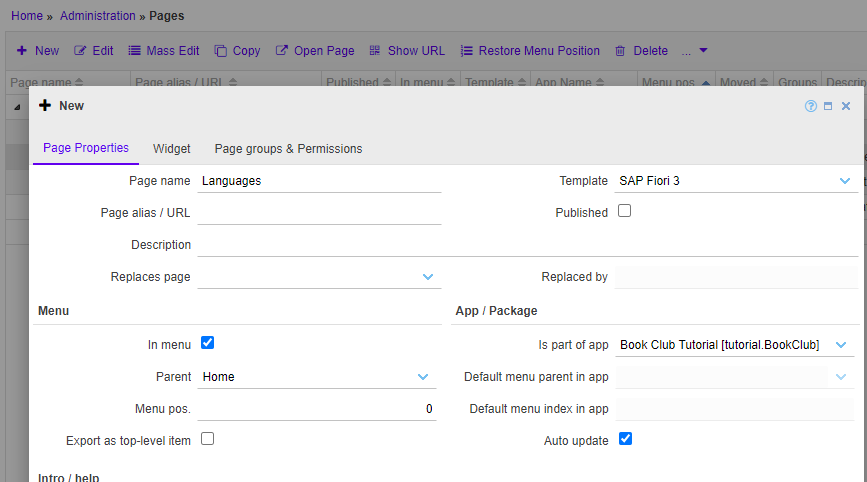
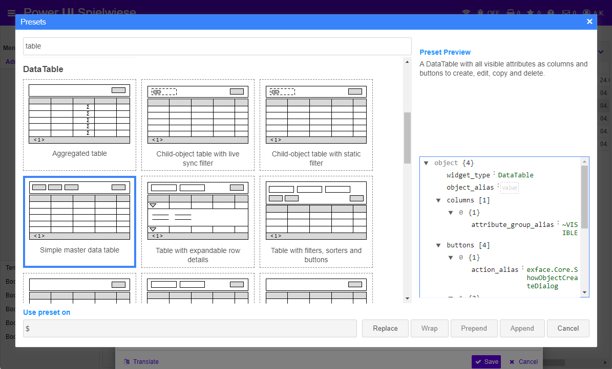
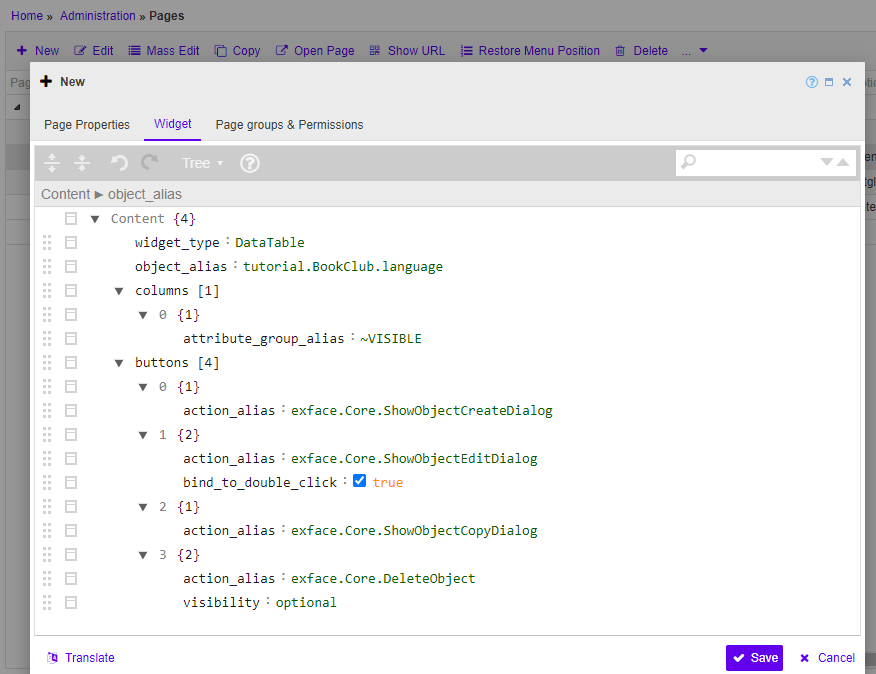
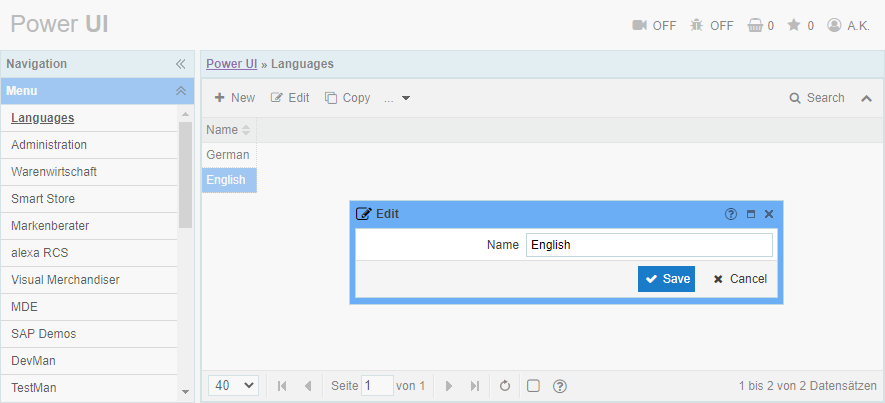
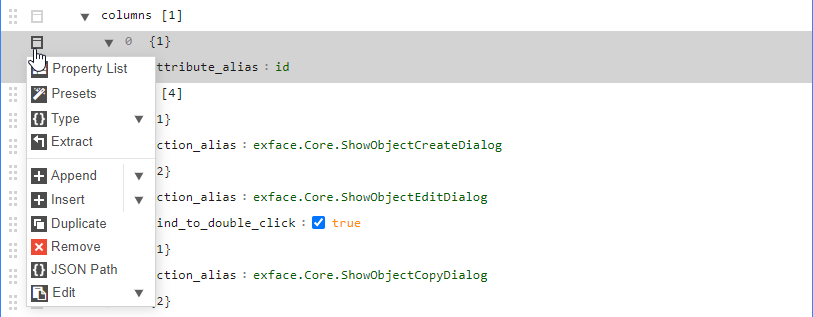
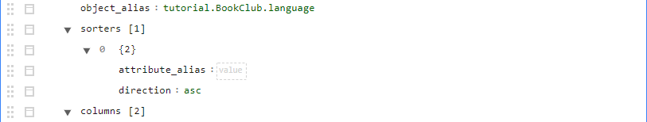
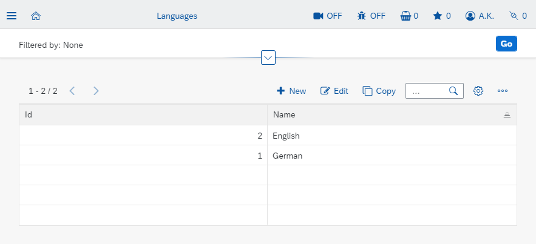

# Creating a simple page

#### [< Previous](04_Generating_a_model_from_an_SQL_schema.md) | [BookClub tutorial](index.md) | [Next >](06_Organizing_pages.md)

Now that we have a [metamodel](04_Generating_a_model_from_an_SQL_schema.md) for the [BookClub tutorial app](index.md), we can start building it's user interface. 

The UI consists of pages - after all, we are in the world of web apps, aren't we? Pages are organized hierarchically in the main menu. For the time being, we will just place a new page at the root leve of the menu - we will add a separate submenu for our app in the [next step](06_Organizing_pages.md).

## 1. Create a page

It is always a good idea to start with creating a simple page to test, if the model works as expected. In our case, we well start with a page to list and manage languages.

1. Go to `Administration > Pages` in the main menu. Here you see an editable version of the menu tree with lots of additional information about each page. 
2. Select the root node `Home` (alias `index`) at the top. 
3. Press `+ New` to create a new page as a child-node of the selected `Home` page. Selecting the parent menu node is far more comfortable than searching for it in the page editor afterwards.
4. Fill the fields in the tab `Page Properties` as follows:
	- Page name: `Languages`
	- Page alias: leave blank - it will be generated automatically
	- Published: `no` - the new UI will only be visible to superusers until published
	- Is part of app: `tutorial.BookClub`
	
	
	
5. Switch to tab `Widget`
6. Press the large magic-wand icon in the middle of the screen. It opens a dialog with configuration presets for widgets. Search for `master data` and select the preset `Simple master data table`.

	
	
7. Press `Replace` to replace the contents of the page with the selected preset. 

	

8. Enter `tutorial.BookClub.language` into the empty `object_alias` field. Now our page is configured to show a table with languages and a standard set of action buttons to create, edit and delete languages.
9. Press `Save` at the bottom of the editor. The new page should appear right below the `index`.
10. Select it and press `Open page`. A new browser window will open showing the resulting UI.
11. Feel free to add a couple of languages. 

As you can see, each page consist of some descriptive information (like it's name) and a widget, that it will display.

The widget configuration above is another example of the [UXON](../../Creating_UIs/UXON/index.md) modeling language. Similarly to the [connection configuration](03_Connecting_to_an_sql_database.md) we've seen before, it sets the options of a widget prototype. Here `DataTable` is the prototype and it can take the options `object_alias`, `columns` and `buttons` among lot's of other properties, that are left with their default values here. Each button is actually a widget of type `Button` itself, but it's `widget_type` is ommitted because the data table "knows", that all the things inside `buttons` are buttons.

The `object_alias` tells the table to display languages, while `attribute_group_alias` makes it show a column for every attribute in the group. There are some built-in attribute groups starting with `~` and `~VISIBLE` obviously contains all visible attributes. In our case it's only the `name` attribute because we've marked all the other attributes as hidden in the [previous step](04_Generating_a_model_from_an_SQL_schema.md).

Similarly, the `action_alias` inside the buttons are references to actions. The actions used here are built-in generic actions, but we can also create custom action models as we will see later.

There are lot's of widgets and actions available and each has numerous configurable properties. The presets behind the magic-wand contain pre-configured typical use-cases for many of them.

All the widget and action properties, that were not explicitly set, will be configured automatically by the workbench based on it's internal logic and the information from the metamodel. For example, we did not really specify, how the editor for a language should look like. The workbench chose chose a small dialog with a single (required) input field for the name of the language - which is perfectly fine to start with.

## 2. Customize the widget

Just to round things up, let's make some changes to our table: let's display the language id too and sort the languages alphabetically.

1. Open the page editor again and switch to the `Widget` tab
2. Specify columns explicitly instead of using an attribute group:
	1. Click on `attribute_group_alias` and replace it with `attribute_alias`. Note the autosuggest popping up while you type. Feel free to use it!
	2. Press `tab` to jump to the next field and replace the old value `~VISIBLE` with `id`
	
		
	
	3. Click on the box-icon to the left of "column number 0" and select `Duplicate` to create a second column
	4. Replace the attribute alias of the second column with `name`
3. Add a sorter to specify default sorting
	1. Click on `columns` and press `Ctrl`+`Shift`+`Ins` or select `Append` or `Insert` in the node-menu of the `columns` node. This will add a blank field-value-pair to the configuration.
	2. Press `space` to see all available properties for the current widget. Type `sorters` and press `tab` to add sorting to the table. The editor will automatically add a sorter-template for you to fill out. Now type `name` in the empty value for the attribute alias of the sorter.

		

5. `Save` the page and refresh the browser tab showing the result to make the changes visible.

The table now has two columns, of which one is sorted. You can click on the column headers to change the sorting. Now try adding `filters` with a filter over language name on your own! It basically the same as adding sorters.

Most pages start with a preset and get quickly tuned up receiving more and more detailed configuration. Every new feature requires just a few lines or a filled-out template to start with, but you have tons of options to override the default behavior by adding more and more UXON properties.

## 3. Use rendering templates

Page templates are basically rendering styles for the widgets. The UXON description of a widget is pretty abstract: it defines, what the widget should do, but not how it should look. The look&feel is controlled by the templates.

The workbench uses different facades to communicate with the outside world: e.g. a command-line facade to handle terminal commands and various HTTP facades to render web pages. Such a web facade will generate HTML and JavaScript from the UXON model. Different facades can use different web technologies and frameworks: jQuery, Angular, React, SAP UI5, etc. Every facade capable of rendering widgets has one templates for different color themes or "skins" it supports. 

You can select a template to use for every page. Since we did not select a specific template for our languages editor, the workbench used the default template to render it - the same look&feel, as in the administration menu. Now let's switch to a more mobile-friendly template: the `Fiori 3`, which is based on SAP OpenUI5.

1. Open the page editor once again
2. In the template-dropdown select `SAP Fiori 3`
3. `Save` the page
4. Refresh the tab with the resulting UI

Note, how different the app looks now. It still has exactly the same core features, but it is now more "responsive" (suitable for mobile devices), it has a table-settings dialog (cog-icon above the table), etc.

In real-world projects, it is a good idea to design apps for a specific template and not to switch back-and-forth. Different templates may implement widget features differently, so get to know each template and select the best fit for your project's specific needs. For example, the jEasyUI templates are great to fit lot's of information on a single screen, but they are not mobile-capable at all. UI5 templates look nice on any screen size, but each control takes a lot more space and there are some technological limitations like the main menu having a maximum depth of 2.   

### [< Previous](04_Generating_a_model_from_an_SQL_schema.md) | [BookClub tutorial](index.md) | [Next >](06_Organizing_pages.md)
