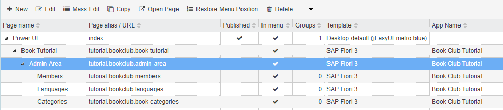
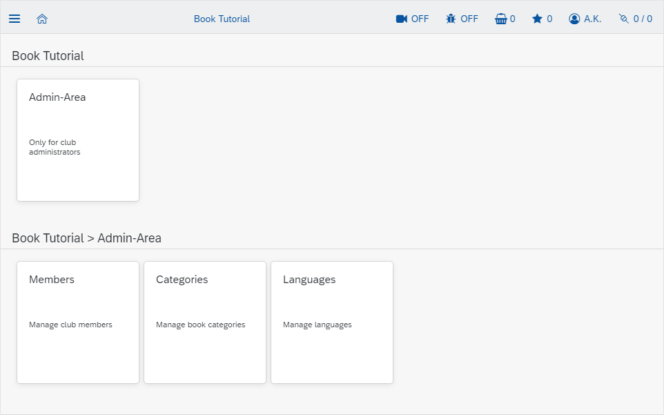

# Organizing pages and navigation

#### [< Previous](05_Creating_the_apps_first_pages.md) | [BookClub tutorial](index.md) | [Next >](07_CRUD_UIs_for_complex_objects.md)

Each UI page has it's unique place in the navigation menu - the tree structure you see in `Administration > Pages`. One specific menu node (the one aliased `index` by default) is concidered to be the root of the main menu, which most templates will display on the left side. Other root nodes of the nav-menu can be created to add totally different custom menus.

In the [previous step](05_Creating_the_apps_first_pages.md) we have placed a new page in the main menu - right below the `index` page. But since our app will surely need multiple pages, it is a good idea to create a submenu. In fact, you are totally free to organize the main menu and other menus in whatever way you like, but a good practice is to add a node to the main menu for every app. This ensures, users with access to multiple apps will have access to a central navigation starting point.

The menu for our Book Club app will look like this:

```
- Book Club
  - My Books
  - Catalogue
  - ...
  - Admin-Area
    - Members
    - Languages
    - Book Categories
    - ...
```

## 1. Create a submenu for the app

The first thing to do is creating the root page for our app:

1. Go to `Administration > Pages` in the main menu. 
2. Select the root node `Home` (alias `index`) at the top. 
3. Press `+ New` to create another direct child page in the main menu. 
4. Fill the fields in the tab `Page Properties` as follows:
	- Page name: `Book Club`
	- Page alias: leave blank - it will be generated automatically
	- Template: `SAP Fiori 3`
	- Is part of app: `tutorial.BookClub`
5. Switch to tab `Widget`
	- Press the magic wand
	- Search for `tile`
	- Select the preset `Tile menu with 2 levels`
6. `Save` the page
7. Select the newly create page and repeat steps 3-6 to create the `Admin-Area` page.

Now we have our menu folders, so we need to populate them.

## 2. Move the languages page to it's menu position

1. Select the `Languages` page from the [previous step](05_Creating_the_apps_first_pages.md) in the tree table. 
2. Drag it with the mouse over the `Admin-Area` node and drop it there. 

The admin-area should now become a folder and the languages page should move inside. 

Alternatively you could also open the page to be moved and select the parent explicitly in the page editor.

## 3. Add other admin-pages

Now let's add administration-pages for members and categories and create some master data to play with! 

1. Follow the section "1. Create a page" from the [previous step](05_Creating_the_apps_first_pages.md) to create two more pages in the admin-area using the `Simple master data table` widget preset and meta objects 	
	- `tutorial.BookClub.member` and 
	- `tutorial.BookClub.category`
	- Feel free to add fill the `description` of the pages too - this will make their tiles look nicer!
2. Add some book categories like "Science Fiction", "Fantasy", etc.
3. Add a member with a link to your current user

**HINT:** you can use the `Mass Edit` button above the tree table with pages to chane the rendering template for multiple pages at once!



If you open the root page of our app now, it should look like this:



### [< Previous](05_Creating_the_apps_first_pages.md) | [BookClub tutorial](index.md) | [Next >](07_CRUD_UIs_for_complex_objects.md)