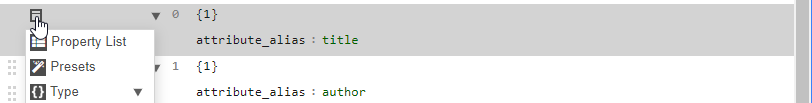
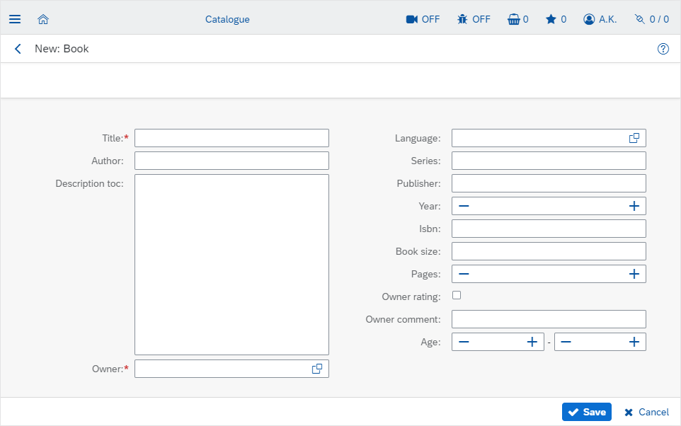

# Creating CRUD UIs for complex objects

#### [< Previous](06_Organizing_pages.md) | [BookClub tutorial](index.md) | [Next >](08_Using_custom_widgets_and_data_types_in_the_model.md)

Now that we have some [administration pages](06_Organizing_pages.md) to manage (simple) master data objects, let's create a catalogue-page, the will let us search for books, create, update and delete them - typical CRUD-operations (Create, Read, Update, Delete). We will also create a custom editor widget for the book instead of the auto-generated editors we used for simple master data objects previously.

## 1. Create a data table with custom columns/filters

Since the book is a fairly complex object with many attributes, simply auto-generating colums for every visible attribute will produce a pretty overfilled and messed up table. For larger objects, it is always a good idea to add columns manually.

1. Go to `Administration > Pages` in the main menu. 
2. Select our app's root node `Book Club`. 
3. Press `+ New` and create a page called `Catalogue` using the UXON preset `Table with filters, sorters and buttons` - similarly to how we created the [languages page](05_Creating_the_apps_first_pages.md) previously. Use the object `tutorial.BookClub.book`. And set the template to `SAP Fiori 3` again.
4. Create columns with the following `attribute_alias`s:
	- `title`
	- `author`
	- `series`
	- `owner__LABEL` - the double underscore "follows" the relation meaning "get the label attribute of the linked owner object" in this case. Just requesting `owner` here would give us the key (id) of the owner object, which would not be really helpful.
5. Add filters over these `attribute_alias`s:
	- `title`
	- `author`
	- `series`
	- `owner` - in contrast to `owner__LABEL` above, we request a filter over the relation itself here, not the label attribute of the related object. A reltion filter will be a dropdown with autosuggest, while a filter over a text attribute would just be an input field!
6. Sort by `title`.
7. Double-check that no empty fields are left in the UXON and the etire preset is filled.

Note how the autosuggest in the UXON editor suggests attributes and relations (with the double underscore at the end) at the same time: select a relation an press `space` to list attributes and relations of the related object, and so on. 

Attribute aliases with relations (like `owner__LABEL` or `owner__user__USERNAME`) are called relation paths. Relation paths can be followed in both directions! The workbench will automatically determine where the foreign keys of the relations are located. This means, you can also use `book__title` as an attribute_alias of the object `member`, which would resolve to "titles of all books of the member". Read more about relation paths [here](../../Creating_UIs/UXON/aliases.md). We will come back to this in later chapters too!

Now `Save` the page, select it and press `Open page` to see it in action. 

Note how the workbench created a relation-select filter for the owner automatically: click it and press space to list available values, start typing to get suggestions or press the icon on the right to open a selection widget. The workbench tries to find the best suitable widget for every constellation in the metamodel - you don't need to specify widget types explicitly in most cases. You can, however, override the widget if needed. We will use this feature to add autosuggests to authors and series [later on](08_Using_custom_widgets_and_data_types_in_the_model.md).

If you catalogue page does not work, here is the full UXON to copy/paste (just call the node-menu of the root node in the UXON editor and select `Edit > Paste`):

```
{
  "widget_type": "DataTable",
  "object_alias": "tutorial.BookClub.book",
  "filters": [
    {
      "attribute_alias": "title"
    },
    {
      "attribute_alias": "author"
    },
    {
      "attribute_alias": "series"
    },
    {
      "attribute_alias": "owner"
    }
  ],
  "columns": [
    {
      "attribute_alias": "title"
    },
    {
      "attribute_alias": "author"
    },
    {
      "attribute_alias": "series"
    },
    {
      "attribute_alias": "owner__LABEL"
    }
  ],
  "sorters": [
    {
      "attribute_alias": "title",
      "direction": "asc"
    }
  ],
  "buttons": [
    {
      "action_alias": "exface.Core.ShowObjectCreateDialog"
    },
    {
      "action_alias": "exface.Core.ShowObjectEditDialog",
      "bind_to_double_click": true
    },
    {
      "action_alias": "exface.Core.ShowObjectCopyDialog"
    },
    {
      "action_alias": "exface.Core.DeleteObject",
      "visibility": "optional"
    }
  ]
}
```

## 2. Define a default editor for the object

Our table already has buttons to add, edit, copy and delete a book. Try to create a book pressing the `+ New` button: type a title and select the owner by pressing the `space` button inside the respective field to list all available members (if you did not create any previously, head to `Book Club > Admin-Area > Members` and add a member linked to your workbench user).

As you can see, the auto-generated editor technically works for complex objects too, but it does not look nice as the workbench cannot know how to order the inputs properly. This is what the `default editor` configuration for a meta object is for. It's a UXON widget configuration that is used automatically when actions like `exface.Core.ShowObjectCreateDialog`, `exface.Core.ShowObjectEditDialog`, etc. are called.

Lets specify a default editor for the `book` object:

1. Head to `Administration > Metamodel > Objects` in the main menu
2. Open the object `book`
3. Switch to the `Default Editor` tab
4. Paste the UXON below: open the node menu for the root node in the UXON editor and select `Edit > Paste`.

```
{
  "widget_type": "Dialog",
  "object_alias": "tutorial.BookClub.book",
  "widgets": [
    {
      "attribute_alias": "title"
    },
    {
      "attribute_alias": "author"
    },
    {
      "attribute_alias": "description_toc",
      "height": 8
    },
    {
      "attribute_alias": "owner"
    },
    {
      "attribute_alias": "language"
    },
    {
      "attribute_alias": "series"
    },
    {
      "attribute_alias": "publisher"
    },
    {
      "attribute_alias": "year"
    },
    {
      "attribute_alias": "isbn"
    },
    {
      "attribute_alias": "book_size"
    },
    {
      "attribute_alias": "pages"
    },
    {
      "attribute_alias": "owner_rating"
    },
    {
      "attribute_alias": "owner_comment"
    },
    {
      "attribute_alias": "age_min"
    },
    {
      "attribute_alias": "age_max"
    }
  ]
}
```

This UXON snippet means, that the default editor for a `book` will be a regular `Dialog` with widgets for every attribute we need to edit in a specific order. 

Additionally we have made the text field for the book's description a little higher - 8 height units means "as high as 8 regular inputs".

This configuration will now be used in all actions/buttons, that produce a book editor: it will have effect on the `+ New` button as well as on `Edit` and `Copy` - go ahead and try it.

## 3. Group widgets to improve form layout

There are still way too many fields simply following one another. The editor still looks as chaos. An easy way to cope with this is grouping inputs.

Let's separate the most important fields (title, author, description and owner) from the others and place the two groups side-by-side.

1. Open the object editor for `book` and switch to the `Default Editor` tab.
2. Open the node menu for the `title` widget - make sure to hit the menu for the whole widget and not that for the `attribute_alias`!
	
3. Select `Presets` in the menu
4. Find the preset `Widget Group without caption` and press `Wrap` at the bottom of the dialog. The `title` widget will now be placed inside the group.
5. Move `author`, `description_toc` and `owner` into the group by grabbing each of the at the six-dots icon next to their node menu an dragging them to the right.
6. Wrap `language` in another widget group
7. Drag all the remaining widgets into that group

The `widget_group` is a widget itself, so you can give it additional properties like `caption` or `width` if you like. You can view all available properties by selecting `Property List` from the node menu of the widget.

## 4. Use inline groups for ranges or value-unit inputs

Another typical usecase for widget groups is placing logically connected inputs next to each other. For example, let's display the `age_min` and `age_max` as a min-max-range.

1. Wrap the `age_min` widget in the preset called `Inline input group for a range`
2. Drag the `age_max` widget into the group
3. Type `Age` into the group's `caption` field

`Save` the book object and try the new editor. Much better now, isn't it?



Here is a copy-paste version of the resulting UXON - just in case.

```
{
  "widget_type": "Dialog",
  "object_alias": "tutorial.BookClub.book",
  "widgets": [
    {
      "widget_type": "WidgetGroup",
      "widgets": [
        {
          "attribute_alias": "title"
        },
        {
          "attribute_alias": "author"
        },
        {
          "attribute_alias": "description_toc",
          "height": 8
        },
        {
          "attribute_alias": "owner"
        }
      ]
    },
    {
      "widget_type": "WidgetGroup",
      "widgets": [
        {
          "attribute_alias": "language"
        },
        {
          "attribute_alias": "series"
        },
        {
          "attribute_alias": "publisher"
        },
        {
          "attribute_alias": "year"
        },
        {
          "attribute_alias": "isbn"
        },
        {
          "attribute_alias": "book_size"
        },
        {
          "attribute_alias": "pages"
        },
        {
          "attribute_alias": "owner_rating"
        },
        {
          "attribute_alias": "owner_comment"
        },
        {
          "widget_type": "InlineGroup",
          "caption": "Age",
          "separator": "-",
          "widgets": [
            {
              "attribute_alias": "age_min"
            },
            {
              "attribute_alias": "age_max"
            }
          ]
        }
      ]
    }
  ]
}
```

### [< Previous](06_Organizing_pages.md) | [BookClub tutorial](index.md) | [Next >](08_Using_custom_widgets_and_data_types_in_the_model.md)