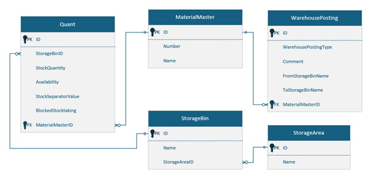

## Understanding the data tables we’ll work with

[<kbd>   Stock Overview   </kbd>](index.md) [<kbd>  < Previous   </kbd>](01_What_to_expect_from_this_tutorial.md) [<kbd>  Next >   </kbd>](03_create_a_page.md)

We’ll be working with several tables in this tutorial. Tables that already exist in a database. It’s not necessary to know all the tables and their attributes to follow the tutorial but if you want to understand better why the following tables were chosen, you can view them under:

1. `Administration > Metamodel > Connections > Select “PowerUI_SQL_Spielewiese auf swusqllogbase” > Click SQL admin and log in.`  

2. Or: Open your **SQL Server Management Studio** and log onto the `swusqllogbase.salt-solutions.de` server. Find the table **PowerUI_SQL_spielewiese**.

Here you can see **ALL** the tables in the database. This database is a copy of the Logbase Mahle project as a playground for this tutorial.

We will use the following tables and their attributes:

- Quant  
- StorageBin  
- StorageArea  
- MaterialMaster  
- WarehousePosting  

Understanding the actual data in this tutorial will help you to understand why we’re connecting which tables. Knowing the concepts of primary and foreign keys is important – so if you have never heard of it, or feel like you need a touch up on the concepts, you can read up on them here:  
[Difference between Primary Key and Foreign Key - GeeksforGeeks](https://www.geeksforgeeks.org/difference-between-primary-key-and-foreign-key/)

---

For your first task, you’ll have to create a visual for the 5 tables above. Ideally, you can use Visual Studio or any other software to create a diagram with – or use a pen and paper to sketch out the relations. You will:

> Create a database schema diagram for a Warehouse Management System with the following components. You'll need to identify entities, attributes, primary keys, foreign keys, and relationships between tables.

### Task

1. Open, as mentioned above, either the **SQL Adminer** or your **SQL Server Management Studio** and find the database.  
2. Design a database schema with the following entities:  
   - Quant  
   - StorageBin  
   - StorageArea  
   - MaterialMaster  
   - WarehousePosting  
3. For each entity, determine:  
   - Appropriate attributes  
   - Primary key(s)  
   - Foreign key(s) where applicable  
   - Relationships between entities (one‑to‑many, many‑to‑many, etc.)  

Your schema should address the following business rules:

- Materials are stored in storage bins  
- Storage bins belong to storage areas  
- Quantities of materials (quants) are tracked in specific storage bins  
- Warehouse postings record movements between storage bins  

**Hint for the structure:**

- Identify primary keys (denoted with **PK**)  
- Identify foreign keys (denoted with **FK**)  
- Draw relationships between tables using appropriate notation  
- Consider cardinality in your relationships (1:1, 1:N, N:M)  

---

### Solution

If your solution is a lot bigger and contains a lot more attributes than the picture above shows – you’ve done it correctly. The goal for this exercise was for you to look at the data tables more closely – which tables have which attributes? We’ll be needing only the ones in the picture above for the rest of this particular tutorial, we will circle back in other tutorials later on.

[<kbd>   Stock Overview   </kbd>](index.md) [<kbd>  < Previous   </kbd>](01_What_to_expect_from_this_tutorial.md) [<kbd>  Next >   </kbd>](03_create_a_page.md)