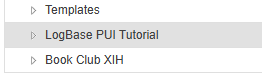
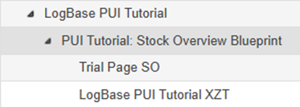
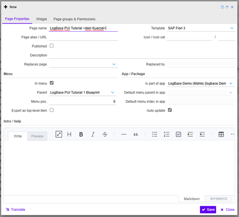
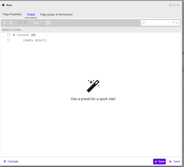
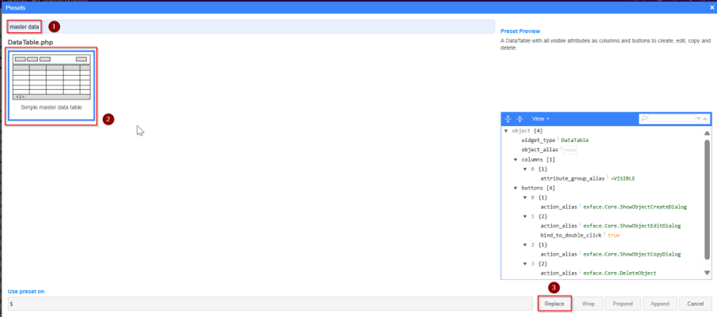
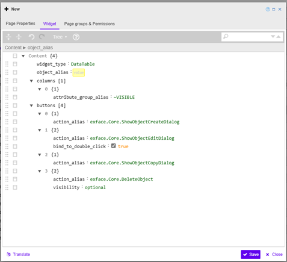
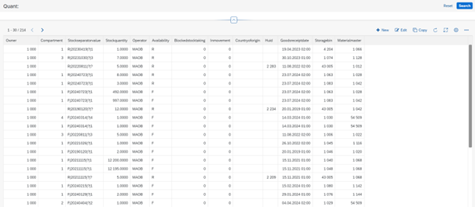

## Create a page 

[<kbd>   Stock Overview   </kbd>](index.md) [<kbd>  < Previous   </kbd>](02_Understanding_the_data_tables_we_will_work_with.md) [<kbd>  Next >   </kbd>](04_create_and_edit_buttons_actions.md)

You will not create a new App or data base. You will work with the ones already set up for the tutorial. You will create pages the same way you did in the BookClub Tutorial.

### Task

Navigate to `Administration > Pages` &nbsp;> Click on **Home** and look for the page named **„LogBase PUI Tutorial“**.

That’s the main page for this tutorial. It holds the navigation tiles (click **Open Page** to see them). Underneath you’ll find several pages:  

1. Stock Overview Blueprint, Warehouse Order Blueprint and Material Master Blueprint. These are the example pages which showcase the end of a tutorial – once you’ve followed all the steps, your page should look like them. **This tutorial will only cover the Stock Overview Blueprint page.**
2. Tutorial Trial Pages: If you ever want to try something without it impacting your tutorial progress, you can try that here. There’s no “undo” button in the PowerUI editors, so changing something should be done consciously. 

All additional pages for this tutorial go under this one. It doesn’t matter what you name your page, just make sure you’re able to identify which one is yours. You can use your SALT abbreviation.

---

### Task

1. **Click** the **„New“** button. Either click on **“PUI Tutorial: Stock Overview Blueprint”** and then **“New”** to assign it as the new page’s parent page, or choose your parent page manually in the **Page Properties**.
2. Give your tutorial page a name: **LogBase PUI Tutorial <dein Kuerzel>**
3. Check that the **Template** is set to **SAP Fiori 3**. SAP Fiori 3 is a certain design developed by SAP. We will use it for this tutorial but there are different designs as well.
4. Check that **„Is part of app“** is set to **LogBase Demo (Mahle)**. In this tutorial, the app we work with is **LogBase Demo (Mahle)** and we’ll only be using this. Generally, though, you’ll use different apps for different projects or modules.
5. Check that **„In menu“** is checked, while **„Published“** is *not*. This sets your page as part of the pages menu structure but doesn’t publish it to access it outside of Administration. You can publish it once you’ve finished this tutorial.

6. Switch to the „Widget“ tab
7. Press the **„Use a preset for a quick start“** magic wand. We will choose a basic preset to give our page a basic structure, just like you’ve done in the BookClub Tutorial.

8. Search **„Master data“** and select the preset. On the bottom‑right you can see the PowerUI (UXON) structure already as a preview. Click **„Replace“**.

> **Fun Fact:** You can’t do anything wrong in this step. You’re just choosing your preset and you’re replacing what’s written in your page editor with the button **“Replace”**.

---

Now you have a basic page structure in your widget editor. The highest level of the pages hierarchy is Content. It contains the basic widget type for your page, in this case a data table because a table is what we want to showcase, and the object_alias. 

The **object_alias** is the reference to an object, hence to a data table that’s located in our data base. Basically, the **object_alias** tells PowerUI: „There’s a table with columns and rows, and data, and its name is <Example> and here’s an alias so you can reference it and know which app it belongs to.“ Without an object_alias PowerUI can’t build your page as it simply doesn’t know what you want. 

For more information on a general structure of a page, look here: [Struktur einer Page - 4D1 Projektwikis - Confluence](https://asgixpo.atlassian.net/wiki/spaces/4d1prjwikis/pages/968261637/Struktur+einer+Page)

To assign an `object_alias` you always need to know:

- **Which app** does the object I want to use for my page belong to? In this tutorial it’s always **logbase.DemoM** (the alias of the app).
- **Which object** do I want to use? Since the objects are the tables in our database, you always want to know your data before building a page.
- **What’s the object’s alias?** As you need to know how to reference the object you want. To check an object’s name, alias, attributes or app, you can view them under `Administration > Metamodel > Objects`.

As we’re working with the widget **DataTable** to show a data table on our page, we have to set the values for the other properties that such a table has – namely, **columns** and **buttons**, as you can see in the preset. For more details on buttons, click [here](https://asgixpo.atlassian.net/wiki/spaces/4d1prjwikis/pages/971964422/Actions+Events+Behaviors).

Otherwise, let’s move on to the buttons you will create and edit. So, for now: your `object_alias` for the main widget of this page follows the **AppAlias.ObjectAlias** format:

**Logbase.DemoM.Quant:** Quant is the name of the table we’ll be working with first. 

9. Set the value of your object_alias to logbase.DemoM.Quant.
10. Click save and open your page via the Open Page button. 

It should look like this:

[<kbd>   Stock Overview   </kbd>](index.md) [<kbd>  < Previous   </kbd>](02_Understanding_the_data_tables_we_will_work_with.md) [<kbd>  Next >   </kbd>](04_create_and_edit_buttons_actions.md)