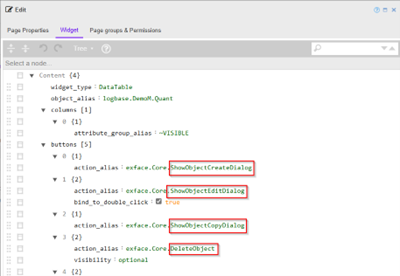
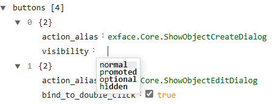
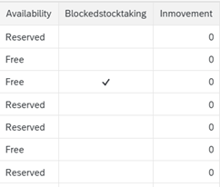
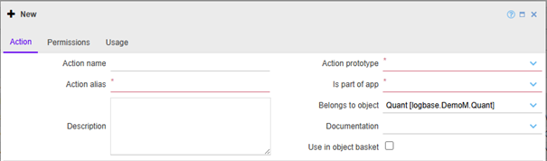
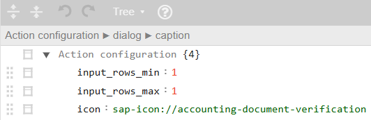
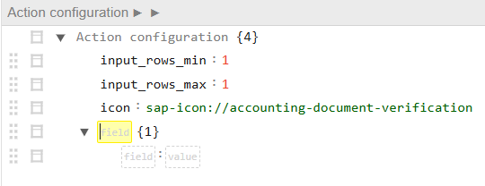
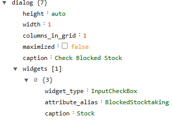

## Create and edit buttons (actions)

[<kbd>   Stock Overview   </kbd>](index.md) [<kbd>  < Previous   </kbd>](03_create_a_page.md) [<kbd>  Next >   </kbd>](05_input_mappers.md)

A button always executes an action upon clicking on it. For more information on how actions work, click **[here](https://asgixpo.atlassian.net/wiki/spaces/4d1prjwikis/pages/971964422/Actions+Events+Behaviors)**.  
An executed action can do many things, prototyped or customized. All action prototypes can be found **[here](https://sdrexf2.salt-solutions.de/powerui-spielwiese/exface.core.docs-action-prototypes.html)**.  
They work with any buttons in any apps. Customized actions on the other hand are called **Object Actions** and only work with the app the object belongs to.

Since every button calls an action, and an action is built and defined through PowerUI, you need an `action_alias` to call it.  
For this tutorial, if you use an **Action Prototype**, use `exface.Core` as the app alias, followed by the name of the action.  
For every custom-made action, use the name of the tutorial app, `logbase.DemoM`, and the name of the action.

The following 4 basic buttons are **Action Prototypes** and part of the preset we chose. They are often used for all sorts of pages:

- **ShowObjectCreateDialog**: Displays the „New“ button & creates a dialog window to add new data to your table.  
- **ShowObjectEditDialog**: Displays the „Edit“ button & creates a dialog in which you can edit existing data.  
- **ShowObjectCopyDialog**: Displays the „Copy“ button & creates a copy dialog of your data (you can edit it or not and then save it as a new entry to your table).  
- **DeleteObject**: Displays the „Delete“ button – **Notice:** Always be careful to press this one, you will **NOT** be asked if you’re sure you want to delete data; it will directly do so. Because of this, the Delete button is hidden by default in the three-points menu.

---

### Task

Open your page to look at how the buttons are positioned. Their design, color, spacing etc. come from the SAP Fiori 3 design of the page.  
A button can have a **visibility**: *normal*, *promoted*, *optional* and *hidden*. *Normal* shows you the same button without a visibility set.

1. **Set the visibility for a button to promoted and save. What does the button do?**  
   a. Sits higher up in the header  
   b. Has a blue-colored background to be more visible  

2. **Why can’t you see the Delete button even though it’s defined in PowerUI?**  
   a. Because the value is set to *optional* which moves the button into the drop-down menu.  
   b. Because the button has no explicit visibility parameter defined, which means it inherits the *hidden* default value from the core configuration.  

3. **Set the visibility of the button to optional and save. What does the button do?**  
   a. Is grey and can no longer be clicked  
   b. Is hidden under the three-dots drop-down menu  

Using preset buttons is convenient. The buttons themselves should always work and create a dialog to either create a new set of data or edit or delete an old one.  
It gets interesting when you start customizing your buttons. Before you continue in this tutorial, be sure to read the following page:  
*[Actions / Events / Behaviors - 4D1 Projektwikis - Confluence](https://asgixpo.atlassian.net/wiki/spaces/4d1prjwikis/pages/971964422/Actions+Events+Behaviors)*

We will build a button that upon clicking on it, will open a dialog to change the status of the column **Blocked Stocktaking** in our table **Stock Overview (Quant)**.  
As of now you should either see nothing in the column, or you can see a check mark. The check mark means the stock is blocked; no check mark means it can be used.

Before you wonder: Yes, the option to change this already exists in the generic **Edit** button.  
For the sake of this tutorial, we will create another one though that looks different and just offers the option to change the **Blocked Stocktaking** values.

To create a custom button, you always need to create an **object action**.  
**Notice:** This tutorial will be done by more than one person. Creating an action only has to be done once before you can continue to use it.  
This means that the same name and alias of an action cannot be used twice. Please choose a name and an alias freely in the following task so the action you create does not have the same name as another.

---

### Task

1. Navigate to `Administration > Metamodel > Objects > Object Actions`  
2. Click **“New”**  
3. As you can see, you need a name (can be chosen freely), an alias (can be chosen freely, can’t contain spaces between words), an action prototype and an app.  
   - **Name:** choose freely (the name has no technical meaning and can have spaces)  
   - **Alias:** choose but don’t add spaces or underscores as this is what PowerUI needs to reference your action  
   - **Action prototype:** `ShowObjectEditDialog` (we want to show something from the object and be able to change it)  
   - **Is part of app:** **LogBase Demo (Mahle)** [`logbase.DemoM`]  
   - **Belongs to object:** **Quant** [`logbase.DemoM.Quant`]  

The functionality of a button is always defined in an action, and not in the page you want to use it with.  
You can define the button in the **Action configuration editor**.

#### Task

1. We want to set the minimum number of records that must be selected for this action to be executed. This prevents the action from being triggered if no data is selected. Append a `field : value` pair:  
   - `input_rows_min : 1`  

2. Then we want to set the maximum to limit the number of records that can be processed at a time. Append a `field : value` pair:  
   - `input_rows_max : 1`  

3. Lastly, we want to assign an icon to our button. There’s an icon library you can access freely **here** or use the one for our example: `sap-icon://accounting-document-verification`. Append a `field : value` pair:  
   - `icon : sap-icon://accounting-document-verification`

Your first block of UXON should look like this:

4. Next, we want to choose what sort of result and format we want when the action is executed, hence the button is pressed. Append an object underneath in the namespace. Assign `dialog` to it.

5. Append six `field : value` pairs beneath:  
   - `height : auto`→  This is the default value for height. If you don’t add any specification for height, this is what PUI will use. You don’t even need to use height at all if the automatically calculated one suits your taste.  
   - `width : 1` → Sets the width of the dialog.  
   - `columns_in_grid : 1` → Tells the dialog how many columns we want shown.  
   - `maximized : false` → Minimizes the dialog.  
   - `caption : Check Blocked Stock` → Gives the dialog a name.  

6. In the namespace of the dialog, we want to define a widget. Append an array and name it `widgets`. Append an object space on the next line and append another three `field : value` pairs underneath.  
   - `widget_type : InputCheckBox`  
   - `attribute_alias : BlockedStocktaking`  
   - `caption : Stock`  

Your UXON should look like this:

As a next step, we will build a button that triggers an action chain and uses an input mapper to update our data. 

[<kbd>   Stock Overview   </kbd>](index.md) [<kbd>  < Previous   </kbd>](03_create_a_page.md) [<kbd>  Next >   </kbd>](05_input_mappers.md)
