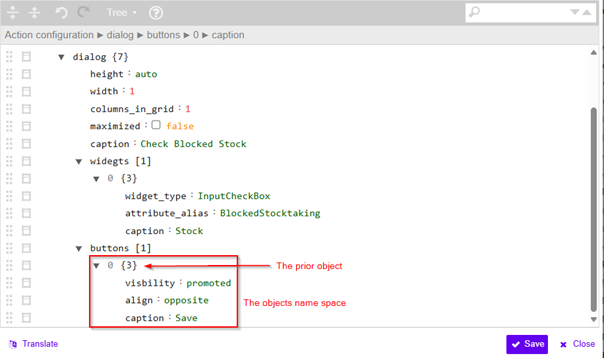
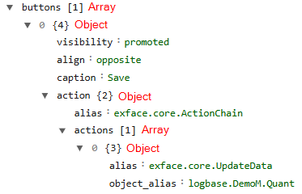
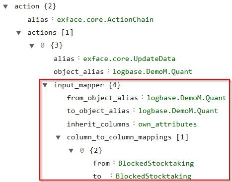
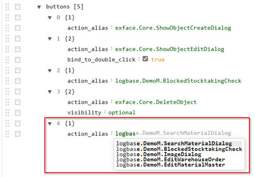
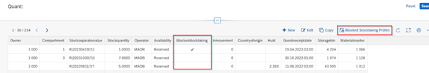
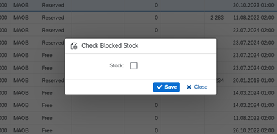

## Input Mappers

[<kbd>   Stock Overview   </kbd>](index.md) [<kbd>  < Previous   </kbd>](04_create_and_edit_buttons_actions.md) [<kbd>  Next >   </kbd>](06_table_relations_attributes_and_columns.md)

In PowerUI, buttons function as the main interface for users to initiate actions within the system. They are essential components that provide clear visual elements for users to click when they want to start an operation.
Buttons act as containers for the actions that need to be executed upon interaction, while also carrying the context of which data should be affected by those actions.
Additionally, they can display loading states or other visual feedback during action execution, giving users important information about the status of their requested operations.
This makes buttons both functional triggers and informative elements within the PowerUI interface. In our example, the button is configured with three properties to make it stand out in the interface and position it appropriately.

### Task

1. Append an array on the same level underneath `widgets`. Name it `buttons`.  
2. Append an object and 3 `field : value` pairs:  
   - Promote the button’s visibility &rarr; Remember how you set the visibility of the other buttons earlier.  
   - Align the new button we’re building to the opposite &rarr; `align : opposite`  
   - Name the button “Save” &rarr; Give it a `caption` to do so.  
3. Append another object inside the prior object space and name it `action`.  
 

4. The appended object should already come with a `field : value` pair. We’ll assign it an `action_alias` but this time it is not done on one line as usual because the **ActionChain** function is more complex.  
   - `alias : exface.core.ActionChain`

---

#### What is an ActionChain?

ActionChain is a feature in PowerUI that allows you to:  

1. **Sequence Multiple Actions:** Execute multiple actions in a specific order  
2. **Control Flow:** Add conditional logic to determine which actions should run  
3. **Data Passing:** Pass data between different actions in the chain  
4. **Reusability:** Create reusable sequences of operations  

The ActionChain in our example contains just one action (`UpdateData`), but in more complex scenarios, you could add multiple actions like:  

- Showing a confirmation dialog  
- Validating data  
- Updating multiple related data objects  
- Refreshing data after update  
- Navigating to another page  

ActionChains are particularly valuable when you need to perform a series of operations that depend on each other, all triggered by a single user interaction.

---

### Task

1. Append a new array inside the `action` object space you just created.  
2. Assign it `actions`, append another object and two more `field : value` pairs.  
   - The first value pair is the name of the action `alias : exface.core.UpdateData`  
   - The second value pair is the `object_alias` we want to reference: `logbase.DemoM.Quant`
   

---

#### What is UpdateData?

`UpdateData` is one of the core actions in PowerUI that enables data modification. It's responsible for:

1. Database Interactions: It handles the actual updating of records in your database  
2. Data Validation: It often performs validation before committing changes  
3. Error Handling: It manages potential errors during the update process  
4. Transaction Management: It ensures data integrity through proper transaction handling  

The `UpdateData` action requires:  

- An `object_alias` to identify which data object to update  
- An `input_mapper` to determine how to map input data to the target object's fields  

This makes it perfect for operations like saving form data, changing status fields, or updating any database records. In this PowerUI example, we need an ActionChain and UpdateData to execute the **“BlockedStocktaking”** verification because the ActionChain provides the structural framework to sequence multiple potential operations, while the UpdateData action specifically handles the database interaction required to persist the BlockedStocktaking status change, ensuring the data is properly validated and committed to the database with precise control over which field is updated.

---

Input mappers are a feature in PowerUI that establish connections between different data objects in your application. They define how data should flow from one object to another, making it possible to:

- Update multiple data sources simultaneously  
- Transform data as it moves between objects  
- Maintain data consistency across your application  

Think of Input Mappers as intelligent bridges that not only connect data objects but also know how to translate information between them.

#### When to Use Input Mappers

Input Mappers are particularly useful when:

1. You need to update data in a database from form inputs  
2. You want to synchronize data between different parts of your application  
3. You need to transform data formats between systems  
4. You're building action chains that process and update information  

Our input mapper consists of the following key components:

1. `from_object_alias`: The source object that provides the data (in our example, `logbase.DemoM.Quant`)  
2. `to_object_alias`: The destination object that receives the data (also `logbase.DemoM.Quant` in our example)  
3. `inherit_columns`: Defines which columns to include in the mapping  
   - `own_attributes` means to include only columns that belong directly to the object  
4. `column_to_column_mappings`: Specific field mappings between source and destination  
   - Each mapping defines which field from the source maps to which field in the destination

As you might have noticed: Our source and destination are the very same object **Quant**. In this particular case, the Input Mapper is being used for a very specific purpose.

Here's why the input mapper is necessary:

1. **Targeted Update Scope:** Even though the source (`from_object_alias`) and destination (`to_object_alias`) are the same object (`logbase.DemoM.Quant`), the Input Mapper is explicitly defining which field should be updated – only the **BlockedStocktaking** field. This prevents unintended updates to other fields in the object.  
2. **Data Transformation Control:** By using `inherit_columns : own_attributes` and specifically mapping only the **BlockedStocktaking** field, it’s ensured that:  
   - Only fields that directly belong to the object are considered  
   - Only the **BlockedStocktaking** field will actually be updated  
3. **User Interface to Data Connection:** Our input mapper takes the current value of **BlockedStocktaking** from the UI (where a user might have changed it) and ensures that a specific value gets saved back to the database.  
4. **Validation and Processing:** The input mapper also provides a hook where validation or transformation of the data can occur before it's committed to the database.  

Without the input mapper, an `UpdateData` action might try to update all fields from the UI to the database, which in this case, we don’t want. So even in this seemingly simple case where we're mapping a field to itself on the same object, the input mapper allows for control over exactly what gets updated and how the data flows between the UI and the database.

---

### Task

1. Inside the `actions` array object, append another object and name it `input_mapper`. You’ll need 3 `field : value` pairs underneath.  
   - `from_object_alias : logbase.DemoM.Quant`  
   - `to_object_alias   : logbase.DemoM.Quant`  
   - `inherit_columns   : own_attributes`  
2. Inside the object space, append an array and call it `column_to_column_mappings`. Append an object and give it 2 more `field : value` pairs.  
   - `from : BlockedStocktaking`  
   - `to   : BlockedStocktaking`  
3. Click **Save**.  

4. Navigate back to `Administration > Pages > Your page` and inside the `buttons` array space, append another object and one `field : value` pair (the pair should appear automatically). Name the object `action_alias` and assign it the action you just created. You’ll need your action’s alias for that.  
5. Give it a `caption : <any name you want>`.  
6. Click **Save**.  

**Note:** In this screenshot, obviously the action you’ve just created doesn’t show up. 

---

As you can see below, you now have a **Button**.

### Task

1. Test your button! Select a data row and click your button.  
2. The following dialog should open. Change the stock, click **Save** and check if your stock status indeed changed in your data table.
 

[<kbd>   Stock Overview   </kbd>](index.md) [<kbd>  < Previous   </kbd>](04_create_and_edit_buttons_actions.md) [<kbd>  Next >   </kbd>](06_table_relations_attributes_and_columns.md)
