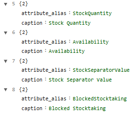
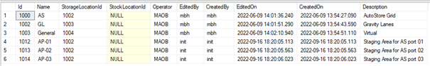

##Table relations: Attributes and columns

[<kbd>   Stock Overview   </kbd>](index.md) [<kbd>  < Previous   </kbd>](05_input_mappers.md) [<kbd>  Next >   </kbd>](07_table_relations_filters.md)

The goal for our page is not just to show one single table – we want two tables on one page, that have a relation with one another. Relations between tables and their attributes are some of the most important concepts to handle PowerUI efficiently. To show two tables on one page we need mainly two things:

1.	Another table to show, in our case the name of the table is WarehousePosting. Don’t forget: A table in our database refers to the object we need in PowerUI.
2.	A new widget_type. 
	a.	Task: Go to Administration > Documentation > Widgets. In the field Name you can search for names or key words of widgets. 
	b.	Find a widget that will split our page and align our tables vertically (one on top, one on the bottom. Try searching the words “split” or “vertical”). 

The highest level of a page always needs an object for reference. So, the structure of widget_type und object_alias stays the same as before but we’ll change DataTable to the new widget_type: SplitVertical. We do need to let the page know again though that we’re working with a data table, and we’ll do that by introducing panels. They’re containers that help us group widgets.

###Task:

1.	Go back to your page. Change “DataTable” to “SplitVertical”
2.	On the line “columns” insert an Array. Name it panel.
3.	Append an object inside the panels array, then append (without choosing a type) inside the object. 

4.	The field name is height and its value is 50%.
5.	Append another array under height and chose “widgets”. Append another object and append several field : value pairs. Remember that we still want to show a DataTable based on our object Quant. Fill them as follows: 
	a.	Caption: let’s call the table Stock Overview on our page.
	b.	Widget type > Which one did we use before to show a table?
	c.	Object alias > Which table to we want?
	d.	The ability to hide the header of the page.
	e.	Save your page. 

**Solution:**

**Notice:** You don’t need to add the numbers inside the braces. Those are automatic counts for the number of elements.

###Task:

As you’ve probably noticed, PowerUI follows a hierarchical structure: Everything under object_alias > panels > widgets applies to the referenced object above. 

1.	Move columns and buttons inside the widgets space of the panels.
2.	Click Save.

**Notice:** Only some hierarchy levels show the name of your arrays – you need to find a level that displays them: Align them with hide_header. Do so by hovering over the 6 squares and drag everything to the right.

1.	Table heights: 
	a.	Set height to 20 %: What happens to the table?
		i.	The table Quant takes up 20 % of the pages space.
		ii.	So far nothing happens as the page only shows one table.
2.	Hide header:
	a.	Set hide header to true (check the box): What happens on the page?
		i.	The header appears on the bottom.
		ii.	The header on top disappears.
3.	Before moving on, set height back to 50% and hide_header to false.

Height tells the referenced table how much space of the page it can occupy. Hide header hides the header on top of the page, including for example filters. These two functionalities are self-explanatory as they simply do exactly as their names suggest.

As you can see, we follow the same logic as before: We need a **widget_type** and an **object_alias**. The line “caption” defines a name for our table – before, PowerUI simply used the name of the data table (Quant). That’s what PowerUI does for everything: You can assign a caption to buttons, filters, tables etc. and if you don’t, the default name of the object is used. It’s up to you to decide what’s user-friendly in your user interface.

To work with the SplitVertical widget we need to leave the hierarchy again.  To work with relations between several objects we established a page that so far shows one table – but we want two. The second table we want to use is called **WarehousePosting**. As the second table we want to introduce is also supposed to be part of the panels, it needs to go inside their name space.

###Task:

1.	Klick “append” on the square left to “panels” to add another field : value pair and align it until it looks as follows. You can click on the arrows to close the drop-down view for better readability. 

2.	Type “widgets” into field and click on it in the drop-down menu when it opens or use the tab key on your keyboard. Notice that the following structure opens automatically.

As we want to reference a second table (WarehousePosting), we again need to tell PowerUI. To do so, we need two things.

1.	How do we reference an object/table? [object_alias : logbase.DemoM.WarehousePosting]
2.	How do we tell the page and PowerUI what kind of widget we want for our table? [widget_type : DataTable]
3.	Additionally, for this specific table we also want to name it something. How? [caption : Warehouse Posting]

To demonstrate what else we need when working with two tables, check again that you have the following lines. Notice: We disabled the line hide header with the two backslashes in front. If you ever want to disable a line being executed in your page without removing it, you can use //.

4.	Click save and open your page. What do you see? What error message is shown? Click on “Details”.

This is shown as we haven’t specified what of the second table we want to see. As you might have noticed, in the widget space for our first table we specified to show the attribute_group_alias as ~VISIBLE, but we haven’t specified any attributes for our second table yet. 

###Task:

1.	Go back to your page. Duplicate the columns section (click on the square menu left and click Duplicate) and drag the duplicate down inside the second widget space. 
2.	Be sure to remove the (copy) text before clicking save again. 
3.	Open your page again: What happens now? You get an error message that the SQL query failed. Since we’re working with MySQL, the column “User” causes troubles because USER is a reserved keyword in MySQL.

To fix this, we will now change the shown attributes of the objects, hence the columns of the tables. We don’t really just want to show all the columns of the two tables – we want them specifically sorted and we don’t really need to see all of them anyway.

###Task:

1.	Go back to your page. Remove **attribute_group_alias** in the columns section of the table Quant and replace it with **attribute_alias**. We no longer want to group anything. Chose the names of the attributes we want to show:

2.	Click save and see how your table changes. Now only the columns we want are displayed.
3.	Scroll to the second table WarehousePosting and do the same:

4.	Click save and open your page. You’ll notice that the error message no longer pops up. 

As we want to understand how exactly relations between tables work in favor for building GUIs with PowerUI, and those few columns per table look a bit lonely, we’ll add some more but not just generic ones. We want to show the additional column “name” from the table StorageArea, which looks like this (you can check in SSMS or the SQL Adminer):

But no, we won’t be introducing another third, full table to do so.

**Notice:** If you try to map the attribute “name” directly, PowerUI won’t know what you want because so far, the tables we’ve introduced in our widgets are called Quant and WarehousePosting, and neither have an attribute “name”. As you can see in the screenshot below, simply adding another attribute won’t do. This is where mapping the relations of the tables comes into play. 

To generally do the following, you need to understand the underlying data base you work with. In our case that’s the data base PowerUI_SQL_Spielewiese. Start your SSMS and select the tables Quant, StorageBin and StorageArea.

USE **PowerUI_SQL_Spielewiese**
SELECT * FROM Quant
SELECT * FROM StorageBin
SELECT * FROM StorageArea

**Or open the SQL Admin as mentioned above.**

Since we want an attribute of a table our main underlying table Quant has no access to, we’ll get there by mapping the connections between Quant and StorageBin, and StorageBin and StorageArea. As you can see in the tables, Quant has a StorageBinId – which is the same as the Id column in the table StorageBin. And StorageBin has another column called StorageAreaId, which is the same as the Id column in the table StorageArea. 

And lastly, we follow the usual logic of an attribute_alias and call the name of the attribute we want (in this case, also Name). PowerUI can follow this “path” of connections as follows:

As you can see, there’s two underscores between everything we want to connect, quite like a visual path. Your main table is already referenced above in the object_alias, which is why you don’t have to mention it every time again in a relation path that’s inside its hierarchy level.

###Task:

1.	Go to your page. Add another object in columns and assign it the attribute alias **StorageBin__StorageArea__Name** and give it a caption.
2.	Save.

Next, we want to add two more columns to our table (Quant) that also come from a different source table. We’ll again be using their relation paths to showcase them in our UI:

2.	The column should be captioned “Material”. 
	a.	You need to map over the table: MaterialMaster (select it in SSMS or SQL Admin to take a look at its attributes and understand their Primary and Foreign Keys)
	b.	You need the attribute: Name
3.	The column should be named: “Material Number”
	a.	You need the table: MaterialMaster
	b.	Which attribute would you use to showcase the material number?
**Hint:** Check the above UML to see how the tables are related.

After having added these two attributes to your table, the columns we want to see are completed. You should have eight columns visible, though it doesn’t matter in which order they appear. As you might have noticed, their order changes depending on the place you wrote them in: If your first attribute_alias is Stock Quantity in UXON, then the first column you see on your page is Stock Quantity. 

###Task:

To restructure the column order based on content, arrange them as follows:

1.	Storage Area
2.	Storage Bin
3.	Material
4.	Material Number
5.	Stock Quantity
6.	Availability
7.	Stock Separator Value
8.	Blocked Stocktaking

Don’t forget to save your page. Before we move on to add the relations of the second table, and finally a relation between these two specific tables, we’ll add filters and sorters.

[<kbd>   Stock Overview   </kbd>](index.md) [<kbd>  < Previous   </kbd>](05_input_mappers.md) [<kbd>  Next >   </kbd>](07_table_relations_filters.md)
