##Table relations: Filters 

[<kbd>   Stock Overview   </kbd>](index.md) [<kbd>  < Previous   </kbd>](06_table_relations_attributes_and_columns.md) [<kbd>  Next >   </kbd>](08_sorters.md)

They’re one of the basic features our chosen preset didn’t automatically have. If you look at other presets though, you notice they’re present in a lot of them. Filters go on the same hierarchy level as buttons and columns do and belong to the same data table they go underneath of.  PowerUI offers several forms of filters, most often used: A pop-up dialog one where you can choose a set of data from a table (called InputComboTable), a free-text field or a drop-down menu (called InputSelect).

**Best practice:** To PowerUI, it doesn’t matter if you first define your columns, then filters and lastly your buttons. But it’s a best practice to follow the graphical user interface design and the preset recommendation: Filters go above buttons and the columns; buttons go above the columns; columns come last.

Filters are elements that filter your table by a specified value. For the table Stock Overview we want five filters. 

1.	Append an Array from your columns element and type “filters” into the field.

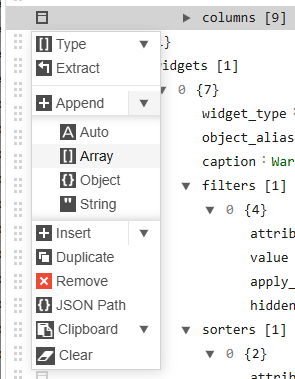

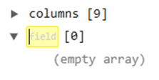

2.	On the line that currently says (empty array), append an object. Now the line underneath shows (empty array) – on that line, simply click append.	

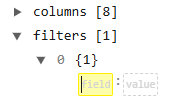

Basic filters follow the same syntax as columns and buttons do: They belong to the table last referenced a higher level above, need an attribute_alias and can be given a caption. 

**Remember:** The attribute_alias is the name of the object you want the filter to work with. The attribute_alias logic follows the same relations we used for our columns. Let’s build the following five filters:

1.	Storage Bin 
2.	Availability
3.	Storage Area: Remember that we weren’t able to map directly to the object StorageArea before in the columns. We still won’t be able to here. For this filter though we don’t want a specific attribute.
4.	Material Number: We don’t want the entire table MaterialMaster in this filter. We just want to filter for the column “number”.
5.	Material Name: We don’t want the entire table MaterialMaster in this filter. We just want to filter for the column “name”.

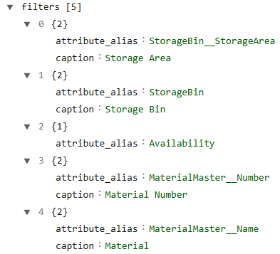

**Notice:** Also, if you followed the tutorial line by line, you need to remove the back slashes in front of hide_header or else your filters won’t show up. Click save after adding the filters and removing the back spaces.

PowerUI offers several formats for filters, so far you can see two on your page: An InputComboTable and a free-text filter. Depending on the usage, these are the ones you want but there’s a third option suitable for a different usability. 

The filter Availability has exactly two values: R (Reserved) and F (Free), so an entire table simply to choose one of two values would be a waste of space. And a free text filter might not be intuitive for users who don’t know what forms of available stock exists.

For situations like that, you can use a drop-down filter. Depending on the data in your table, PowerUI might build your filter as a drop-down already. If not, but you want one, you can change the widget to InputSelect and work with that. Now let’s change our Availability filter to a drop-down menu. There’re several ways in PowerUI to do so, but here, we’ll use the version where we look at the data type of the attribute we want to filter as this offers the possibility to implement as many drop-down menu options as you want. First, we need to create a new Data Type we will then assign to our attribute (Availability). 

###Task:

1.	Go to Administration > Metamodel > Data Types
2.	Click “New”
3.	Choose LogBase Demo (Mahle) [logbase.DemoM] as “Is part of app” so PowerUI knows your new Data Type is for this specific App.
4.	Give your Data Type a name: Availability  <dein Kuerzel>
5.	Give your Data Type an alias: Availability<dein Kuerzel>  -> Don’t add any spaces between words.
6.	Choose “StringEnumDataType.php” as your Prototype. This is important as it already sets boundaries for what your Data Type can or can’t do. A String Enum is a set list of text values we will later define. String means its text, and Enum is a set list.
7.	Under Configuration, append a field : value pair: show_values : false, because we don’t want to show the values that are saved in our data table in our drop-down menu. For other use cases that might be different, but for this one, we will assign text to our values, and we want that text displayed. This is because our data table only holds “R” und “F” – and again, a person new to the project might not know what those letters stand for.
8.	Append an object on the next line and name it value. Add two more field : value pairs underneath. This is where we assign the text to our data table values. Assign “Reserved” to R and “Free” to F.

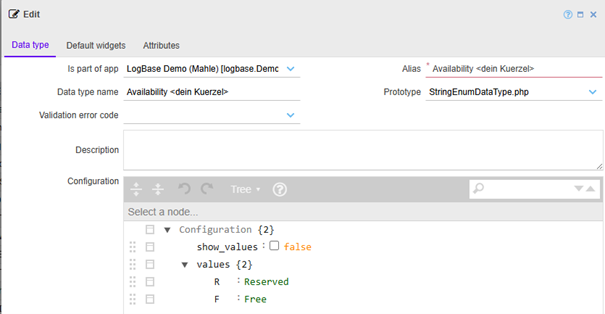

9.	Click save. Your new Data Type should now appear at the top of the Data Types list.

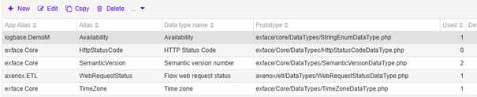

10.	Availability is an attribute of the object Quant. So next, we want to assign the new Data Type to Availability. Go to Administration > Metamodel > Objects > And search for Quant.

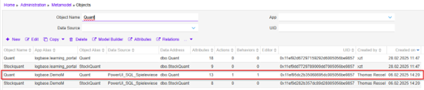

11.	Open it and go to its attributes tab. Open the attribute Availability.

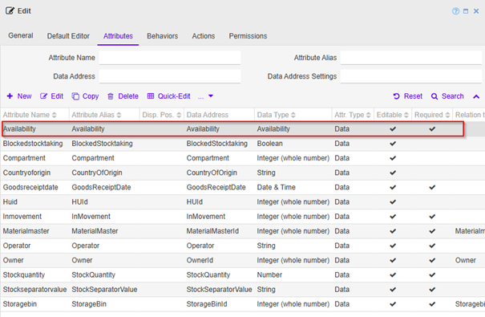

**IMPORTANT!**

**Notice:** The Data Type of Availability is already set to Availability. Which is the Data Type I created when writing this tutorial. Now replace it with YOUR Availability Data Type that you created (Availability<dein Kuerzel>) and click save.

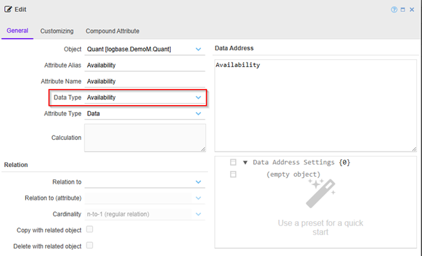

**These 12 steps are responsible for the text you see in your column Visibility in the table quant. If not for this, the column would simply show the letters R and F, as that’s how it’s saved in your data table.** Check the table in your SSMS or the SQL Adminer if you want to see it. 

12.	This was all in preparation to build a drop-down menu for your filter Availability. With the new data type that has very clear text values assigned, now the only thing we need to do is to tell PowerUI to show it as drop-down menu. Open your page again and navigate to your filter’s namespace.
13.	Append an object underneath the attribute_alias : Availability. Declare it as an input_widget.
14.	Append two more field : value fields underneath and specify: 
	a.	widget_type : InputSelect 
	b.	multi_select: true

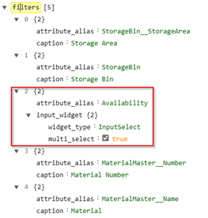

15.	Click save. Now your Availability filter should look like this:

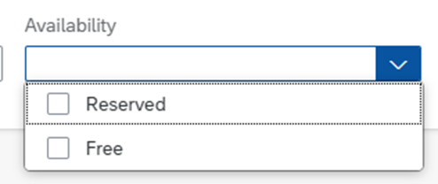

[<kbd>   Stock Overview   </kbd>](index.md) [<kbd>  < Previous   </kbd>](06_table_relations_attributes_and_columns.md) [<kbd>  Next >   </kbd>](08_sorters.md)