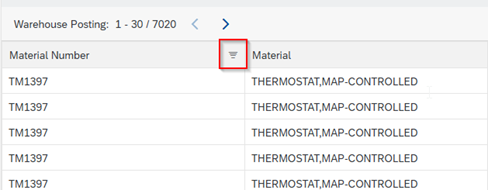
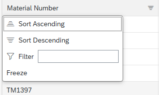
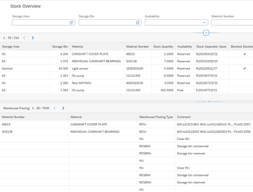
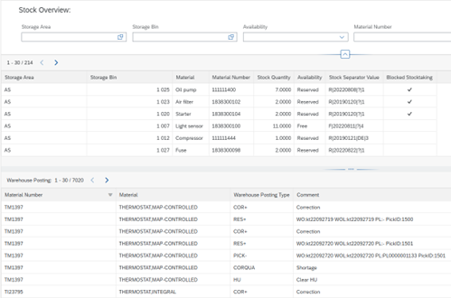
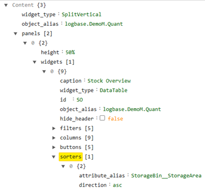

##Sorters

[<kbd>   Stock Overview   </kbd>](index.md) [<kbd>  < Previous   </kbd>](07_table_relations_filters.md) [<kbd>  Next >   </kbd>](09_rinse_repeat_relations_attributes_columns_and_filters.md)

Next, we’ll add sorters to our two tables. There are basically two kinds: The first are sorters that are automatically implemented in every table and can be opened upon clicking any column. They offer the ability to sort a column descending, ascending or by value.

The second kind can be added specifically to sort a set of data by default whenever the site is open. So instead of looking like this:

Your table will look like this:

They’re an easy feature in PowerUI to sort values in a column however you want. In UXON, they’re on the same hierarchical level as buttons, filters and columns are. We want to add this second kind specifically to sort our columns Storage Area.

##Task:

1.	Inside the widgets space of your Quant object, append another array and call it sorters. 
2.	As all the other elements, sorters also need to be told which column they belong to. They need an attribute_alias to know what to sort. Append an object space inside the array.
3.	Append two field : value fields underneath.
4.	As mentioned above we want to sort the column Storage Area – a column not directly available in Quant. As you might remember, we used path mapping to get to it. This too, is no different for sorters. 
	a.	Attribute_alias : StorageBin__StorageArea
	b.	Direction : asc

**Solution:**

[<kbd>   Stock Overview   </kbd>](index.md) [<kbd>  < Previous   </kbd>](07_table_relations_filters.md) [<kbd>  Next >   </kbd>](09_rinse_repeat_relations_attributes_columns_and_filters.md)