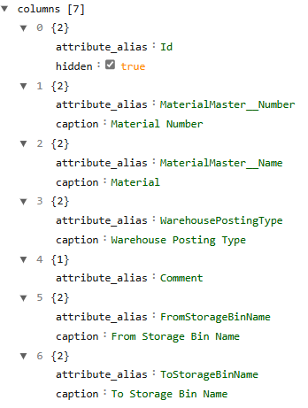
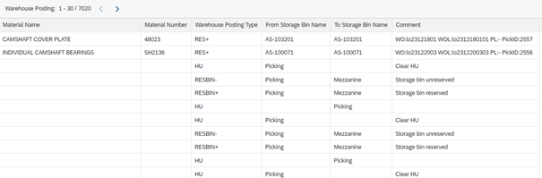
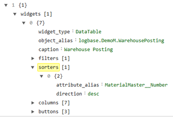

##Rinse & Repeat: Relations, attributes, columns and filters

[<kbd>   Stock Overview   </kbd>](index.md) [<kbd>  < Previous   </kbd>](08_sorters.md) [<kbd>  Next >   </kbd>](10_interacting_tables.md)

Now we’ll be adding more columns to the second table (Warehouse Posting) in the lower half of the page. So far, we have three columns: Warehouse Posting Type, From Storage Bin Name and To Storage Bin Name. We’ll be adding four more columns

###Task:

1.	**Id:** No relation path required, but we do need to hide this column. This column is needed for the next task.
2.	**Material Number:** We want to map from the table MaterialMaster again and use its attribute number.
3.	**Material:** We want to map from the table MaterialMaster again and use its attribute name.
4.	**Lastly**, sort the material columns as the very first to show in your table.

Try to add these columns by yourself before checking the answer/picture below. You’ve been shown the syntax and structure of everything before.

So far, the Warehouse Posting table still looks very unorganized. We will fix that by implementing a functionality we have already learned about: Sorters.

###Task:

1.	Go to your page and the widgets space of your object WarehousePosting. 
2.	Append an array and inside an object, just like you’ve done for the other sorter. Name the array sorter and again, assign it:
	a.	Attribute_alias : [We want to sort the column Number. As before, this too is a column that does not exist in WarehousePosting and we used relation mapping to get it. Go back to Table relations: Attributes and columns and figure out how we mapped Number.]
	b.	Direction : desc

5.	Save your page. Now your columns are sorted by default. As you can see, this feature isn’t the most complex one while delivering a result that looks more organized and structured. 

[<kbd>   Stock Overview   </kbd>](index.md) [<kbd>  < Previous   </kbd>](08_sorters.md) [<kbd>  Next >   </kbd>](10_interacting_tables.md)
