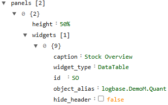
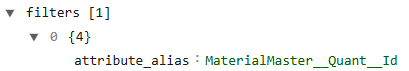
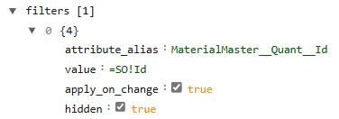

##Interacting tables

[<kbd>   Stock Overview   </kbd>](index.md) [<kbd>  < Previous   </kbd>](09_rinse_repeat_relations_attributes_columns_and_filters.md) [<kbd>  Next >   </kbd>](11_behaviors.md)

We will implement a new filter that’s imbedded in the connection of the two tables, thus causing Warehouse Posting to be **sorted accordingly to whichever data has been chosen/clicked** on in the table Stock Overview. Meaning: When a row is selected in the master table (captioned Stock Overview, actual table: Quant), the detail table (Warehouse Posting) will automatically filter to show only related records.

The first thing we must do is to give the first table an id. Similarly to data inside a table, this is to unmistakenly be able to identify and reference the ENTIRE table. An id for a table is part of its properties and should be placed in the table’s widget space, as seen in the next picture:

Id: SO -> When naming an id, you can be as creative as you want. You might remember having set an id column in the prior step and having set it to hidden. That was in preparation for this task. This hidden column in the table contains the id (id : SO) that will be used by the filter in the second table. 

###Task:

1.	Add a “filters” Array inside the widget space for WarehousePosting.
2.	Add an Object space underneath and map the two tables we want to connect: MaterialMaster and Quant. We don’t just want the tables themselves, we want to use the Id column we just created, so add the attribute Id at the end of your attribute_alias path.

3.	Add another field : value pair beneath and use the following syntax:
	a.	Value : =SO!Id -> value is the field and =SO!Id is the value.
		i.	= indicates a dynamic reference
		ii.	SO is the Id name of the first table
		iii.	! is a separator
		iv.	Id is the attribute from the first table being referenced.
4.	Add apply_on_change : true, so the interaction between the tables happens automatically.
5.	Add hidden : true, as we don’t want to see the filter in our GUI.

**Check that you have:**

1.	The id : SO pair in the widget space for the object Quant.
2.	The Id column in WarehousePosting, and have it set to hidden.
3.	Referenced the Id in the attribute_alias for the hidden filter in the object WarehousePosting.
4.	Given the hidden filter in your object WarehousePosting the value : =SO!Id.

Once you have all those four, save your page and open it. Now click on a set of data in your top table and watch how the bottom table automatically sorts itself by the value “Material”. And that’s it, the two tables are now connected and react to each other’s values. 

[<kbd>   Stock Overview   </kbd>](index.md) [<kbd>  < Previous   </kbd>](09_rinse_repeat_relations_attributes_columns_and_filters.md) [<kbd>  Next >   </kbd>](11_behaviors.md)