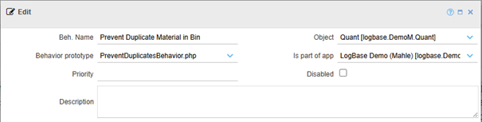
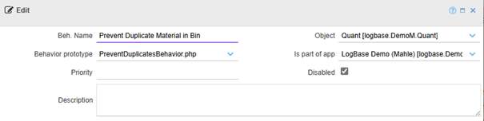
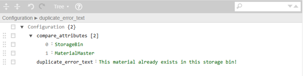
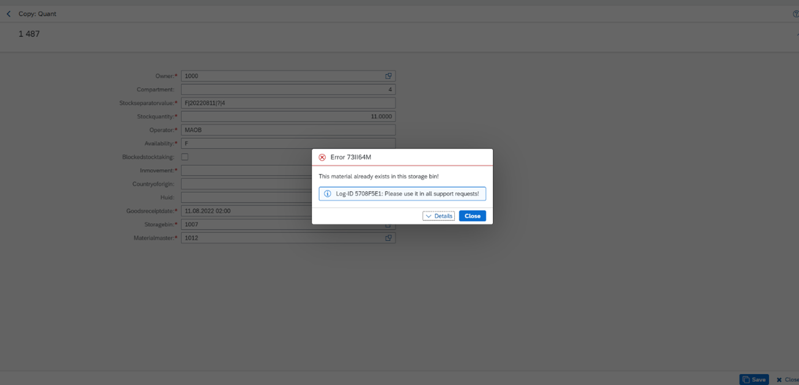

##Behaviors

[<kbd>   Stock Overview   </kbd>](index.md) [<kbd>  < Previous   </kbd>](10_interacting_tables.md)

To understand the theory behind behaviors, you can read the following Wiki page: [Actions / Events / Behaviors - 4D1 Projektwikis - Confluence](https://asgixpo.atlassian.net/wiki/spaces/4d1prjwikis/pages/971964422/Actions+Events+Behaviors)

This will be the last step for this tutorial: We will create a behavior for our UXON so a certain action is prohibited: Duplicating a set of data. To view all existing behaviors, go to Administration > Metamodel > Objects > Objects behaviors. In that regard, behaviors are like actions: They have Behavior Prototypes (which you can find here [Behavior Prototypes](https://sdrexf2.salt-solutions.de/powerui-spielwiese/exface.core.docs-behavior-prototypes.html?&prefill=%7b%22meta_object_id%22:%220x11e86314af5caf7f971b0205857feb80%22,%22rows%22:%20%5b%5d%7d)) and Object Behaviors, that are specific to an object. 

•	For every object specific behavior, you need to pick a prototype. 
•	You need to name your behavior.
•	You need to choose an object for your behavior.
•	You need to decide which app the behavior belongs to.

**IMPORTANT!**

A behavior only has to be written once and saved, and it will always apply to the object you assign it to. So, in order to check if your behavior works, make sure to give your behavior a distinctive name. In creating this tutorial, the behavior “Prevent Duplicate Material in Bin” was already created by me – to check yours:

•	Give it a distinctive name.
•	Write an original error message.
•	Disable my behavior & save. 

###Task:

1.	Find the behavior “Prevent Duplicate Material in Bin”
2.	Check the Disabled field

3.	Save and close. 
4.	Click “New” and as mentioned above, name your behavior.
5.	Assign it the object it belongs to: Quant
6.	Assign it to the app it belongs to: LogBase Demo (Mahle)
7.	Assign the behavior prototype: PreventDuplicatesBehavior

What this behavior will do, is check if a specific material (identified by MaterialMaster) already exists in a specific storage location (StorageBin). If the system finds that this combination already exists when someone tries to create or move it, it will prevent the action and display the error message. 

Task:

1.	Append an array inside the Configuration space and name it compare_attributes, which is what we’ll need to implement the logic.
2.	Append two field : value pairs inside the array space.
	a.	0 : StorageBin - The first attribute to compare is the “StorageBin” field
	b.	1 : MaterialMaster – The second attribute to compare is the “MaterialMaster” field.
3.	Lastly, we’ll have to implement an error message to be shown and assign it some text:
	a.	Insert another field : value pair and drag it under 1 : MaterialMaster so it’s on the same hierarchical level as compare_attributes.
	b.	Assign it an error message: This material already exists in this storage bin! or any creative 

4.	Press save. Open your page, choose one set of data in the first table and click “Copy”.
5.	Without changing anything, click “Save”.
6.	The error message you put in should now pop-up (in the picture below you can see mine). 

**Lastly:** Please make sure to go back to your behavior and disable it. If you don’t, the next person doing the tutorial won’t be able to check if their own behavior works!

And that’s it! For now, that’s the end of this tutorial. Well done! 

[<kbd>   Stock Overview   </kbd>](index.md) [<kbd>  < Previous   </kbd>](10_interacting_tables.md)