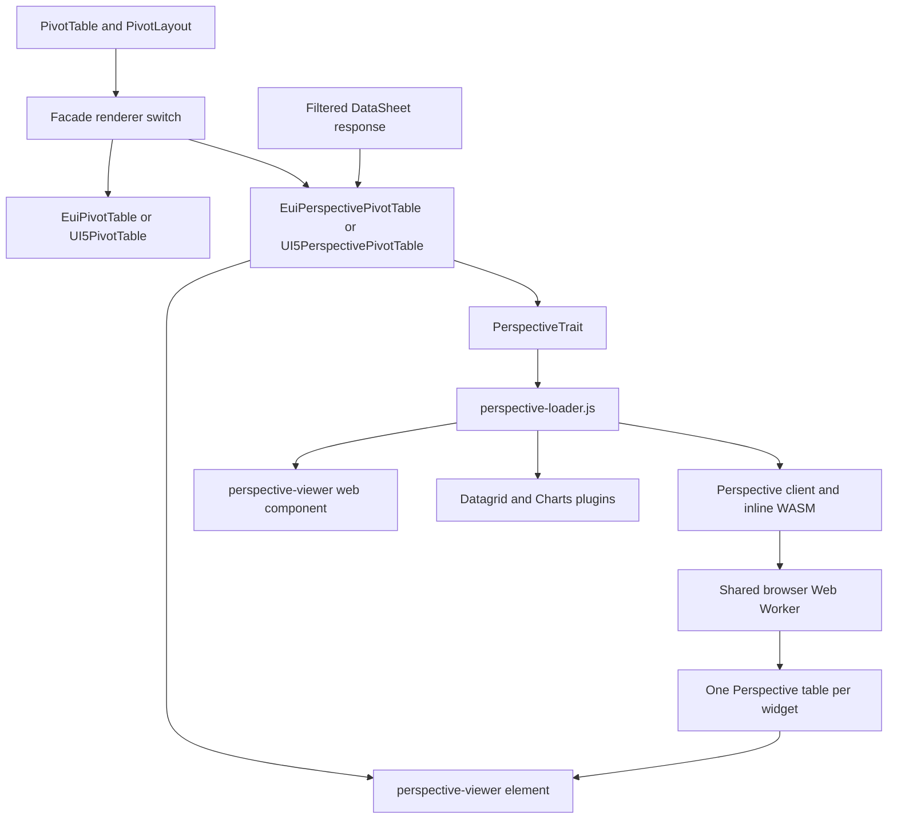

# Perspective for PivotTable

This document describes how the ExFace `PivotTable` widget is rendered with
[Perspective](https://perspective.finos.org/), how facade implementations connect to the
shared integration, and which constraints must be preserved when changing it.

The current implementation is an optional MVP alternative to PivotTable.js. Data is still read through
the normal DataSheet AJAX request and loaded completely into the browser. Perspective then
provides client-side grouping, pivoting, aggregation, filtering, sorting, a configurable
datagrid, and charts. Server-side Perspective queries are not implemented.

Both renderers use the same `PivotTable` and `PivotLayout` widget model. Each facade selects one
of two independent element classes through `WIDGET.PIVOTTABLE.RENDERER`. The default is
`PivotTable.js`, so installing or developing the Perspective implementation does not change
existing PivotTable behavior unless the facade explicitly opts in.

## Components and responsibilities



| Component | Responsibility |
| --- | --- |
| `Widgets/PivotTable.php` | Data widget model; disables pagination and owns a `PivotLayout`. |
| `Widgets/Parts/Pivot/PivotLayout.php` | Configures initial row dimensions, column dimensions, values, aggregators, and view. |
| `Facades/AbstractAjaxFacade/Elements/PerspectiveTrait.php` | Builds Perspective schema/config, normalizes values, owns the render lifecycle, and maps the widget model to Perspective. |
| `Facades/AbstractAjaxFacade/js/perspective/perspective-loader.js` | Dynamically imports Perspective ES modules once per page. |
| `Facades/AbstractAjaxFacade/js/perspective/perspective.css` | Replaces Perspective's small monospace defaults with compact facade-native typography. |
| `JEasyUIFacade/Facades/Elements/EuiPivotTable.php` | PivotTable.js implementation and its isolated jQuery instance. |
| `JEasyUIFacade/Facades/Elements/EuiPerspectivePivotTable.php` | Perspective implementation; converts a DataSheet response to caption-keyed rows and uses normal HTML head includes. |
| `UI5Facade/Facades/Elements/UI5PivotTable.php` | PivotTable.js implementation and its UI5 module registration. |
| `UI5Facade/Facades/Elements/UI5PerspectivePivotTable.php` | Perspective implementation; extracts rows from a UI5 `JSONModel` and registers Perspective assets through the UI5 controller. |

## Selecting the renderer

Both facade configurations contain:

```json
"WIDGET.PIVOTTABLE.RENDERER": "PivotTable.js"
```

Set it to `Perspective` to opt the entire facade into Perspective:

```json
"WIDGET.PIVOTTABLE.RENDERER": "Perspective"
```

The comparison with `Perspective` is case-insensitive. Any other value falls back to the normal
`EuiPivotTable` or `UI5PivotTable` class and therefore to PivotTable.js.

PHP traits cannot be selected dynamically: traits are composed when a class is declared. The
facades instead override `getElementClassForWidget()` and select a concrete class before the
element is constructed. This keeps renderer-specific HTML, JavaScript, lifecycle hooks, and
assets out of the inactive implementation.

Only the selected class participates in response generation and rendering. In particular:

- jEasyUI loads the isolated `jQueryPivot`, jQuery UI, Plotly, and PivotTable.js assets only for
	`EuiPivotTable`;
- UI5 registers PivotTable.js modules and CSS only for `UI5PivotTable`;
- Perspective modules, theme, facade CSS, Web Component, worker, and table lifecycle exist only
	in the two `*PerspectivePivotTable` classes;
- both implementations continue to consume the same `PivotTable`/`PivotLayout` model. Model
	changes therefore remain the one shared regression surface.

The switch is facade-wide because `AbstractAjaxFacade` caches the resolved element class by
widget type. Supporting different renderers for individual PivotTable widgets would require a
widget property and a cache key or construction path that also includes that property.

## Browser data flow

1. `PivotTable` reads all rows through the facade's normal DataSheet request. Pagination is
	disabled by `PivotTable::init()`.
2. The concrete facade converts every row from DataSheet column names to widget column captions.
3. The facade calls `PerspectiveTrait::buildJsPerspectiveRender()` with a JavaScript array of
	plain row objects.
4. `perspective-loader.js` imports the client, viewer, Datagrid plugin, and Charts plugin. A
	single promise prevents duplicate imports.
5. The trait derives a Perspective schema from the widget columns and normalizes every value.
6. One shared Perspective worker is stored as `window.exfPerspectiveWorker`.
7. Each `<perspective-viewer>` owns its table in `viewer.exfPerspectiveTable`. A refresh deletes
	the old table, creates and fills a new one, then restores the layout derived from `PivotLayout`.
8. Perspective performs subsequent grouping, aggregation, filtering, and sorting in the worker
	without another DataSheet request.

The complete dataset is held both in the AJAX response and in Perspective. This is suitable for
the current intended scale, including demonstrations with approximately 10,000 rows, but memory
and initialization time grow with the full result size. Do not enable DataSheet pagination for
this implementation: Perspective would otherwise calculate only over the currently loaded page.

## Dependencies and facade configuration

Facade packages using the trait require matching versions of all Perspective packages:

```json
{
	 "require": {
		  "npm-asset/perspective-dev--client": "^5.3",
		  "npm-asset/perspective-dev--viewer": "^5.3",
		  "npm-asset/perspective-dev--viewer-datagrid": "^5.3",
		  "npm-asset/perspective-dev--viewer-charts": "^5.3"
	 }
}
```

All package versions should remain aligned. The viewer and plugins use internal APIs and are not
safe to upgrade independently.

Add these source paths to the facade configuration:

```json
"LIBS.PERSPECTIVE.LOADER.JS": "exface/core/Facades/AbstractAjaxFacade/js/perspective/perspective-loader.js",
"LIBS.PERSPECTIVE.CLIENT.JS": "npm-asset/perspective-dev--client/dist/esm/perspective.inline.js",
"LIBS.PERSPECTIVE.VIEWER.JS": "npm-asset/perspective-dev--viewer/dist/cdn/perspective-viewer.js",
"LIBS.PERSPECTIVE.DATAGRID.JS": "npm-asset/perspective-dev--viewer-datagrid/dist/cdn/perspective-viewer-datagrid.js",
"LIBS.PERSPECTIVE.CHARTS.JS": "npm-asset/perspective-dev--viewer-charts/dist/cdn/perspective-viewer-charts.js",
"LIBS.PERSPECTIVE.THEME.CSS": "npm-asset/perspective-dev--viewer/dist/css/pro.css",
"LIBS.PERSPECTIVE.FACADE.CSS": "exface/core/Facades/AbstractAjaxFacade/js/perspective/perspective.css"
```

### Why the inline client is required

The regular client CDN bundle resolves its WASM relative to the original scoped NPM package
layout. Asset Packagist installs scoped packages under renamed directories such as
`perspective-dev--client` and `perspective-dev--server`. The regular bundle consequently requests
an invalid path such as `npm-asset/server/dist/wasm/perspective-server.wasm`.

`perspective.inline.js` embeds the server WASM and avoids this package-path mismatch. Do not
switch back to `dist/cdn/perspective.js` without verifying WASM requests in a real installation.

### Content Security Policy

The inline client creates a Blob-based Web Worker. Facades with a Content Security Policy must
allow it explicitly:

```json
"FACADE.HEADERS.CONTENT_SECURITY_POLICY.WORKER_SRC": "'self' blob:"
```

Without `worker-src`, browsers fall back to `script-src` and block the worker. Typical symptoms
are an empty viewer, a CSP console error mentioning a `blob:` URL, or a failed Perspective worker
initialization.

### ES module URL handling

Perspective is distributed as ES modules. A string such as
`vendor/npm-asset/.../perspective.js` is treated by `import()` as a bare module specifier and
fails, even though the same string works as a regular script `src`. The shared loader resolves
every configured asset against `document.baseURI` with `new URL(...).href` before importing it.

The first call stores the import promise in `window.exfPerspectiveReady`; therefore all viewers
on one page use the first set of module URLs. A rejected import promise also remains cached until
the page is reloaded.

## Implementing a facade element

The class using `PerspectiveTrait` must provide `getFacade()`, `getWidget()`, and `getId()` and
must render a `<perspective-viewer>` with the element ID. In a conventional
`AbstractAjaxFacade` element:

1. Use `buildHtmlPerspective()` for the inner HTML.
2. Merge `buildHtmlHeadTagsForPerspective()` into the element's head tags.
3. Convert the loaded response to plain objects keyed by widget column caption.
4. Call `buildJsPerspectiveRender($rowsJs)` after each successful load.
5. If the facade manually handles resizing, call `viewer.resize()` only after checking that it
	is a function. Before the web component is upgraded, the DOM element has no `resize()` method.

### jEasyUI

`EuiPerspectivePivotTable` uses `buildHtmlHeadTagsForPerspective()` and returns a dedicated `pivotdata`
array from `buildResponseData()`. This response is already keyed by captions and can be passed
directly to the shared renderer.

Perspective does not depend on jQuery UI. The old PivotTable.js workaround with a second isolated
jQuery instance must not be restored. The current integration uses the page's normal jQuery only
to emit the compatibility event described below.

### UI5

UI5 controls modules and CSS through `UI5ControllerInterface`, so `UI5PerspectivePivotTable` registers the
loader, theme, and facade CSS in `registerExternalModules()` instead of calling
`buildHtmlHeadTagsForPerspective()`.

`UI5DataElementTrait::buildJsDataLoaderOnLoaded()` receives a `sap.ui.model.json.JSONModel`, not
the raw AJAX response. Rows must be read using:

```javascript
const rows = oModel.getData().rows || [];
```

When overriding this method, alias and call the original trait implementation so standard UI5
post-load behavior remains active:

```php
use UI5DataElementTrait {
	 buildJsDataLoaderOnLoaded as buildJsDataLoaderOnLoadedViaTrait;
}
```

Calling `.rows.forEach()` directly on the model causes `Cannot read properties of undefined
(reading 'forEach')`. Calling the alias without declaring it causes a server-side `Call to
undefined method ...buildJsDataLoaderOnLoadedViaTrait()` error.

## Data contract and type conversion

Perspective identifies columns by their display captions in this integration. This contract is
intentional because `PivotDimension` and `PivotValue` resolve to widget `DataColumn` captions.
Both facade adapters must therefore translate DataSheet field names to the exact same captions
before calling the renderer.

Captions must be unique within a PivotTable. Duplicate captions collapse into the same object key
and Perspective column. Changing a caption also changes the Perspective schema/config key; saved
Perspective configuration is not currently persisted across page loads.

The schema mapping is:

| ExFace type | Perspective type | Normalization |
| --- | --- | --- |
| `NumberDataType` | `float` | `Number(value)` |
| `BooleanDataType` | `boolean` | Accepts `true`, `1`, `"1"`, and `"true"` as true. |
| Non-calculated `DateDataType` | `date` | `new Date(value)` |
| Non-calculated `DateTimeDataType` or `TimeDataType` | `datetime` | `new Date(value)` |
| Other and calculated date/time columns | `string` | Kept as returned by the DataSheet. |

Empty strings and missing values become `null`. Enum values are replaced with their ExFace labels.

Calculated date/time columns deliberately remain strings. ExFace formulas can return formatted
labels such as `Mar`, `03`, or `11`; treating these as dates produced `null` or arbitrary browser
timestamps. This also means a calculated column that genuinely returns a date is not currently
typed as a Perspective date and cannot use Perspective's date-specific operations without an
explicit future model distinction.

Numeric formatting uses Perspective's `number_format` object with `minimumFractionDigits`,
`maximumFractionDigits`, and `useGrouping`. Perspective 5 silently ignores the older/provisional
`fixed` property. ExFace number prefixes, suffixes, custom decimal separators, and custom group
separators are not yet mapped; Perspective uses browser `Intl.NumberFormat` behavior.

## Mapping PivotLayout to Perspective

| PivotLayout property | Perspective configuration |
| --- | --- |
| `rows` | `group_by` |
| `columns` | `split_by` |
| `values` | `columns` plus one entry per value in `aggregates` |
| `view` | `plugin`, and for heatmap/table-bar views also `columns_config` |
| Widget enabled | Settings panel is opened. |
| Widget disabled | Settings panel is closed and opening it is prevented. |

Multiple `values` are supported in both enabled and disabled widgets. An empty `aggregates`
configuration must serialize as `{}`, not `[]`; Perspective expects a map and rejects an empty
sequence with `invalid type: sequence, expected a map`.

### Aggregators

| ExFace aggregator | Perspective aggregator |
| --- | --- |
| `SUM` | `sum` |
| `AVG` | `avg` |
| `COUNT` | `count` |
| `COUNT_DISTINCT` | `distinct count` |
| `MAX` | `high` |
| `MIN` | `low` |
| `LIST`, `LIST_DISTINCT` | `join` |

Unknown aggregators currently fall back to `sum`. Add explicit mappings when introducing new
supported aggregators; a silent numeric fallback may be incorrect for strings or dates.

### Views and plugins

| PivotLayout view | Perspective plugin/style |
| --- | --- |
| `table` | `Datagrid` |
| `table_bar_chart` | `Datagrid` with foreground bars on numeric columns |
| `heatmap`, `heatmap_per_row`, `heatmap_per_column` | `Datagrid` with gradient backgrounds on numeric columns |
| `chart_bars`, `chart_bars_stacked` | `X Bar` |
| `chart_columns`, `chart_columns_stacked` | `Y Bar` |
| `chart_line` | `Y Line` |
| `chart_area` | `Y Area` |
| `chart_pies` | `Sunburst` |
| Other values, including `export_tsv` | `Datagrid` fallback |

The three heatmap variants currently have the same styling. Stacked and unstacked bar variants
currently select the same plugin and rely on its defaults. `export_tsv` is not a dedicated view;
Perspective's own export menu remains available in interactive mode.

Perspective provides hierarchy rollups for `group_by`, but the current trait does not explicitly
map `show_row_totals`, `show_column_totals`, `show_row_subtotals`, or
`show_column_subtotals`. Treat their current behavior as a Perspective default, not as full
compatibility with the PivotTable widget model.

## Formulas and calculated columns

Formulas are evaluated by the normal DataSheet/column calculation path before data reaches
Perspective. The resulting column is loaded like every other widget column, so formulas such as a
duration calculated from start and end timestamps can be used as values without Perspective
expression syntax.

Perspective also supports client-side `expressions`, but the trait does not currently translate
ExFace formulas into them. If expressions are added later, keep server/DataSheet formulas and
Perspective expressions conceptually separate: they have different syntax, type inference,
execution location, and persistence behavior.

## Viewer lifecycle and events

The worker is shared globally, but tables are per viewer. On refresh the existing table is deleted
before a replacement is created. Keep this cleanup when changing the loading flow; otherwise every
filter refresh leaks a Perspective table in the worker.

`viewer.load(table)` is functional in Perspective 5.3 but logs a deprecation warning. The preferred
future API is to load the table's client and restore a named table. Migrate this only after testing
refresh cleanup and multiple PivotTables on the same page.

After `restore(config)`, enabled widgets call `toggleConfig(true)` and disabled widgets call
`toggleConfig(false)`. Disabled widgets also cancel `perspective-toggle-settings-before`.
Listeners are bound once using `viewer.exfPerspectiveEventsBound`.

Every Perspective configuration change emits the legacy-compatible jQuery event:

```javascript
$(viewer).on('pivotrendered', function (event, payload) {
	 // payload.element_id
	 // payload.object_alias
	 // payload.config
});
```

The event payload contains Perspective's current saved configuration. The trait therefore assumes
jQuery is available, as it is in current `AbstractAjaxFacade` implementations.

## Styling and sizing

Perspective's Pro theme defaults to a small monospace interface. It initially looked pixelated in
both facades even though device pixel ratio, browser zoom, and element dimensions were correct.
`perspective.css` applies the facade font family and a compact 12 px size to both the viewer and
the generated plugin slotted into it. The plugin selector is required because the Datagrid uses
its own shadow tree and otherwise resets to Perspective's monospace variable.

Load `perspective.css` after `pro.css`. If Perspective changes its generated slot naming in a
future release, inspect the computed font on all of these layers:

1. `<perspective-viewer>`
2. `<perspective-viewer-datagrid>` or the active chart plugin
3. `<regular-table>`
4. A rendered `td` or `th`

The custom element may exist before its module upgrades it. Resize hooks must use a guard such as
`typeof viewer.resize === 'function'`. Perspective also observes its size, so a facade usually
needs an explicit `resize()` only after panel/fullscreen layout changes.

## Troubleshooting

### `Failed to resolve module specifier 'vendor/...'`

The dynamic import received a relative string that looked like a bare package name. Keep URL
normalization in `perspective-loader.js` and pass all module paths through the facade's
`buildUrlToSource()`.

### Requests for `npm-asset/server/dist/wasm/...` return 404

The regular client bundle is being used. Configure `perspective.inline.js`; it embeds the WASM and
does not rely on the original scoped-package directory layout.

### Blob worker is blocked by CSP

Add `worker-src 'self' blob:`. Adding `blob:` only to `script-src-elem` does not permit workers.

### `invalid type: sequence, expected a map`

A map-shaped Perspective option was serialized from PHP as an empty JSON array. In particular,
empty `aggregates`, `columns_config`, `plugin_config`, and `expressions` values must be JSON
objects where Perspective expects maps.

### UI5 reports `Cannot read properties of undefined (reading 'forEach')`

The post-load hook treated a UI5 `JSONModel` as a raw response. Read
`oModel.getData().rows || []`.

### UI5 reports an undefined `buildJsDataLoaderOnLoadedViaTrait()` method

The override calls an alias that was not declared. Add the trait adaptation shown in the UI5
integration section.

### Viewer is present but empty

Check, in order:

1. Browser console for module, WASM, CSP, or Perspective restore errors.
2. That `exfLoadPerspective`, `window.exfPerspectiveWorker`, and
	`viewer.exfPerspectiveTable` exist.
3. That the facade supplied an array of caption-keyed rows.
4. That the schema captions exactly match `group_by`, `split_by`, `columns`, and `aggregates`.
5. That the viewer has non-zero width and height.

### Text looks pixelated or unusually small

Inspect computed fonts before investigating canvas resolution. The integration is DOM-based for
Datagrid and normally renders at a 1:1 device scale. Verify that `perspective.css` loads after the
Pro theme and reaches the generated plugin slot.

## Verified behavior

The initial implementation was verified in both jEasyUI and UI5 with Perspective 5.3.1. Browser
tests covered:

- module loading from local Asset Packagist paths;
- inline WASM and Blob worker startup under CSP;
- DataSheet loading and refresh;
- true date columns and formatted calculated date labels;
- numeric precision/grouping configuration;
- interactive grouping, sorting, and filtering controls;
- simultaneous `SUM` and `AVG` value columns;
- Datagrid and `X Bar` rendering;
- enabled and disabled settings-panel state;
- facade-native typography and non-zero widget sizing.

The UI5 and jEasyUI Perspective implementations should both be retested whenever the shared loader, trait,
Perspective package versions, schema mapping, or CSS selectors change.

## Future development checklist

Before extending or upgrading the integration:

1. Keep all Perspective package versions aligned.
2. Verify actual distribution filenames under `vendor/npm-asset`; package names and plugin names
	changed between Perspective releases (`viewer-charts` replaces older D3FC assumptions).
3. Test module imports, WASM loading, and worker CSP in a real generated page.
4. Test both renderer values in both jEasyUI and UI5 because their asset registration and response adapters differ.
5. Test no-value layouts so map-shaped options still serialize as `{}`.
6. Test multiple value columns in enabled and disabled widgets.
7. Test true dates, formatted date formulas, enums, booleans, nulls, and numeric formatting.
8. Test refresh repeatedly and confirm old tables are deleted.
9. Test Datagrid plus at least one chart plugin.
10. Inspect typography through the plugin shadow tree and test panel/fullscreen resizing.
11. Document any newly mapped PivotLayout option and distinguish it from Perspective defaults.
12. For a future server-side implementation, preserve the DataSheet security/filtering contract
	 and define how Perspective query state is translated into DataSheet filters, sorters,
	 aggregators, and grouping before removing the current all-rows load.
