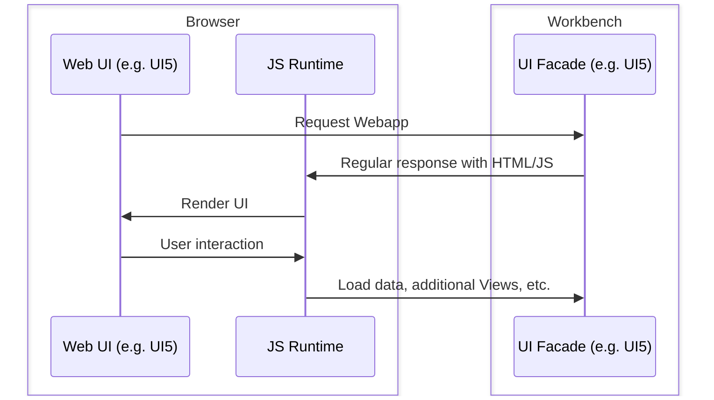
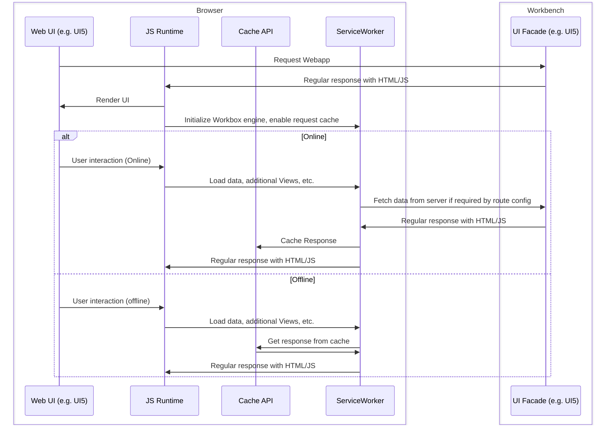
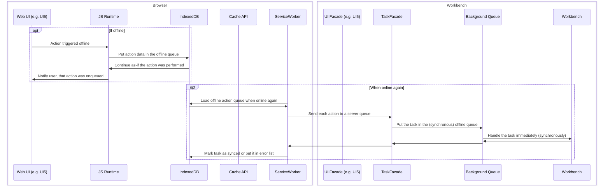

# Introduction to offline work

## Regular web apps with AJAX requests (online)

Normally web apps work by sending browser requests to their facade API all the time, as shown below.

## Progressive web apps

Progressive web apps (PWA) use special APIs offered by all modern browsers to allow the user to continue to work with the app if the connection is lost. The workbench allows facades to implement multiple levels of offline capability. But in any case, working offline requires a Service Worker - a special type of web worker with the ability to intercept, modify and respond to network requests.

The core includes a JavaScript toolbox `exfPWA.js`, that can be used to quickly add support for working offline with. It offers tools for the following features.

### Caching previously loaded data for offline use

The most simple way to make the app available offlie is to cache all assets (HTML, javascript and server responses) in the browser and use it when offline. Modern browsers offer a special "Cache API" to do this: it can be used by Service Workers to cache entire requests and use them to respond to the regular JS runtime, thus mimicing the behavior of the server. The logic of the web app actually may even be unaware, that it is offline!

### Buffering and syncing actions performed offline

Facades can also buffer actions performed offline and sync them with the server in background when the connection is restored.

