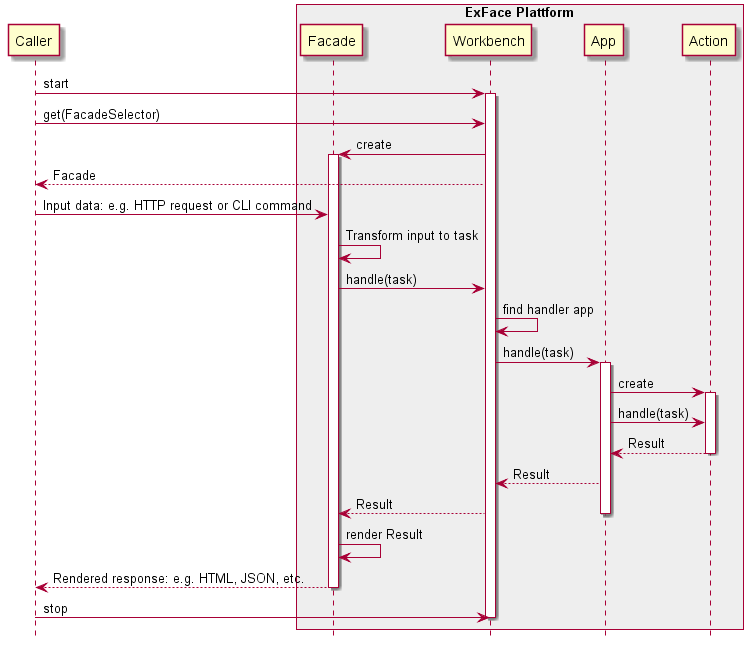

# Developer's documentation

## Quick links

1. [Getting started](contributing/Contributing_on_GitHub.md): git branches, pull requests, etc.
2. Apps from a technical point of view
 - [The app as dependency container](app_as_container.md)
 - [Installing an app](App_installers/index.md) - initializing app dependencies like SQL schemas, facade routes, etc.
3. [The workbench in detail](workbench.md)
4. [Using metamodel components in the code via selectors](Using_metamodel_components_in_the_code_via_selectors.md)

## Technical overview

In a nutshell the platform acts as command bus behind a changable facade:

Regardless of where it is called from (a web service endpoint, a console application, some plugin in another system or anything else), the caller talks to a facade, which actually defines what sort of input it accepts and what the output will be. This input data can be anything, but in most cases it must contain some kind of reference to the action that is to be performed. 

Once the caller passes some valid input data (e.g. an HTTP request or a CLI command), the facade transforms this data into an internal structure called "Task", which essentially is a data trasnfer object (DTO) similar to a classical command. 

The task is then passed to the workbench to find a suitable handler. The workbench is comparable to a command bus at this point: it inspects the task data to find an app, that is capable of handling it. Once the handler-app is determiend, the task is passed on to it. 

The app now uses it's internal logic actually perform the required action and return a result-object (another type of internal DTO). The default app implementation will load the action specified in the task and let it compute the result. In principle, app developers can implementy any logic for task handling - there are no restrictions. The default logic with handlers built into action [prototype classes](../understanding_the_metamodel/prototypes.md) has proven to be very versatile and really easy to extend, though.

In result object is now passed all the way back to the facade, which can now render a response that is understandable to caller (e.g. an HTTP response or CLI output) and finally return it to the caller.

## Main components

- **Workbench** - central dependency container. In addition to routing tasks to apps it's main responsibility is providing access to core features like logging, caching, translation, etc.
- **Facade** - an interface to the outside world. Facades translate requests and commands from the outside workd into internal tasks and translate task results into whatever the outside expects (e.g. HTML and JavaScript, JSON, etc.). There are UI-facades for various UI frameworks (e.g. jEasyUI, SAP UI5, etc.), but also webservice facades (e.g. the internal DocsFacade or ProxyFacade) or even command line facades.
- **Apps** are primarily containers for business logic. An app should be responsible for some bounded context.