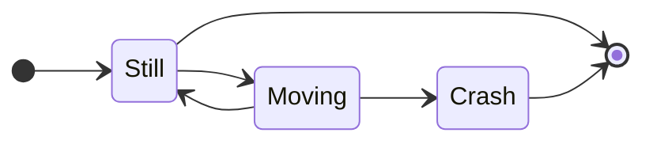

# Drawing diagrams

Diagrams help undertand processes a lot. Whenever a business process or a technical sequence is described in the docs, it is a good idea to add a diagram. In order to keep all diagrams homogenous and easy to understand, UML 2.0 should be used if possible.

## Diagramming tools

### Mermaid - embedded diagramming

Mermaid is a markup language for diagramming. It can be directly included in the documentation without exporting the diagram as an image. It is the recommended approach for diagramming, since the markup is also supported on GitHub, GitLab and other versioning platforms.

- There is a good WYSIWYG editor here: https://mermaid.live/

To include a diagram, simply paste it into a codeblock like this:

````

````


### PlantUML - free tool to create diagrams

[PlantUML](http://plantuml.com/) is a wide spread diagramming tool, that can be used to generate images and insert them into the docs. It is free to use and works with plain text sources, that can be easily versioned together with the actual diagrams. The syntax is different from mermaid, but it is a similar approach. There are plenty of plugins for various editors and even web browsers. Here are those used by the core team:

- [Eclipse plugin](http://plantuml.com/eclipse)
- [Google Chrome plugin](https://chrome.google.com/webstore/detail/plantuml-viewer/legbfeljfbjgfifnkmpoajgpgejojooj)

All diagrams in the default documentation are located in Docs/diagrams: each as a .puml source file and an equally named .png file. Although this approach is not required, it has proven a good choice and is worth a recommendation.

## Diagram types

As a rule of thumb, use simpler diagrams like the acitivity (process flow) diagram for business processes and more specific ones like the class or sequence diagram in technical documentation.


